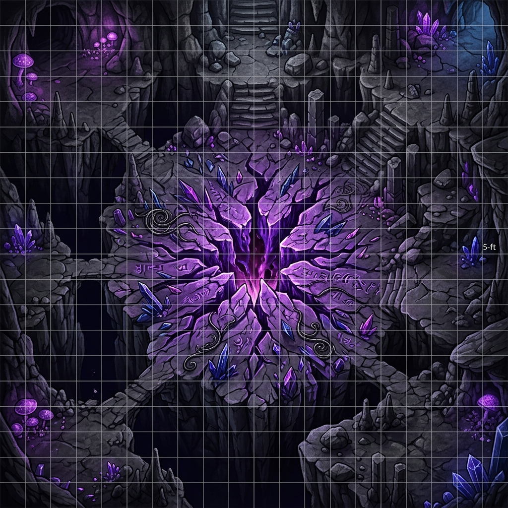

# Act IV: Descent Into the Deepmind Annex
## The Campaign Climax (Adventure Module for Level 13)

This chapter provides the Dungeon Master (DM) with the complete adventure keys, encounter designs, and mechanical rules for the final act of the campaign. The players must navigate the non-Euclidean brine-veins, defend the sealing ritual, and survive the ancient betrayal of the Lords of Dust.

---

## 1. ADVENTURE BACKGROUND & RUNNING ACT IV

Following the Githyanki air raid in Act III, Sablehook is hidden under Banki's unstable **Tri-Weave Shroud**. However, the psychic resonance of the repaired *Tri-Weave Silver Blade* and the widening of the **The Void of Madness Tear** mean that invisibility is only a temporary shield. 

The Elder Node is actively pulling the planar tissue of The Void of Madness (the Realm of Madness) into the brine-veins beneath Blackwater Quay. If the tear is not sealed within 24 hours, the Daelkyr's fleshwarping aura will burst onto the surface, dissolving the region.

### The Coalition's Plan
1.  **The Vanguard (The PCs):** The characters lead the descent, clearing the path through the warped caverns.
2.  **The Sealing Team:** **Kaelen Grey ("Suture")** and **Hruujj (Terik)** follow immediately behind to lay the lead-silver seals.
3.  **The Sovereign Anchor:** **Banki** accompanies the party to the Rift Core, using the *Null-Fang* and the *Sovereign Thread* to negate the planar bleed during the ritual.
4.  **The Rear Guard:** **The Tarkanan's Marked Syndicate** enforcers (led by Kessler) hold the sewer entry locks to prevent the Elder Node's surface compliant thralls from flanking the party.

---

## 2. THE DEEPMIND ANNEX KEY

The Annex is a series of non-Euclidean chambers where space bends and gravity is unstable. Range increments for ranged attacks are halved, and spell ranges are reduced by 50% due to spatial compression.

```
                  +--------------------------------+
                  |    [A-1: The Weeping Vaults]   |
                  +--------------------------------+
                                  ||
                  +--------------------------------+
                  |     [A-2: The Gravity Flue]    |
                  +--------------------------------+
                     //                        \\
    +---------------------------------+  +-------------------------------+
    |  [A-2b: Chronal Echo Hall]      |  | [A-3: Cathedral of Whispers]  |
    |  (Optional Puzzle & Loot)       |  +-------------------------------+
    +---------------------------------+                  ||
                     \\                        //
                  +--------------------------------+
                  |     [A-4: The Rift Core]       |
                  +--------------------------------+
```

### Area A-1: The Weeping Vaults
*   **Description:** The old dwarven sluice chambers have been overrun by fleshy, purple growths that weep compliance fluid (diluted Blue-Drop). The air is humid and smells of vinegar.
*   **Encounter:** **4 Compliant Sewer Enforcers** and **1 Chirg-Illithid** (Elder Node Avatar). 
*   **Tactics:** The Chirg-Illithid stands on a raised stone platform, using its *Mind Blast* to stun the party while the enforcers attempt to drag stunned characters into the acidic sewage channels (dealing 2d6 acid damage per round).
*   **Hazard: Compliance Mist:** The room is filled with compliance vapors. All living creatures must make a Fort DC 18 save every 3 rounds or be *fatigued* and take a -2 penalty to Will saves.

### Area A-2: The Gravity Flue
*   **Description:** A vertical, 120-foot cylindrical shaft lined with rusted iron ladders. Planar energy from the rift causes gravity to fluctuate wildly in this shaft.
*   **Hazard: Gravity Fluctuations:** At the start of each character's turn, they must roll a d4:
    1.  *Normal Gravity:* No effect.
    2.  *Reverse Gravity:* The character falls upward toward the ceiling (taking 4d6 falling damage unless they grab a ladder rung with a Reflex DC 18 check).
    3.  *Lateral Gravity:* Gravity shifts to the left wall. Characters are thrown sideways.
    4.  *No Gravity:* The character floats. Movement is halved, and melee attacks have a -2 penalty.
*   **Encounter:** **3 Dolgaunt Cell-Guards** crawl along the walls. They are immune to the gravity shifts due to their Aberrant heritage. They attempt to grapple characters and pull them off the ladders.
*   **Branching Path:** At the bottom of the flue, the passage splits. The left tunnel leads to the optional **Chronal Echo Hall (A-2b)**; the right tunnel leads directly to the **Cathedral of Whispers (A-3)**.

### Area A-2b: The Chronal Echo Hall (Optional Puzzle Room)
*   **Description:** A silent cavern where shards of glass-like Sylvan crystal float in mid-air. Moving through the room triggers localized chronal delays—characters see their own past selves repeating their actions.
*   **The Spatial Puzzle:** The cavern floor is divided into a 5x5 grid of glowing runes. Moving across the grid activates past memories. 
    *   *The Trap:* If a character steps on a rune out of sequence, a *Temporal Echo* of their character appears and attacks them (using their same stats, but having only 20 HP).
    *   *The Solution:* By studying the echoes of Kael's past path (Intelligence check DC 20 to isolate his chronal footprints), characters can trace the safe sequence: *North, East, North, West, North*.
*   **Loot:** At the center of the hall lies a warded brass chest from an alternate timeline where the Consortium won. It contains:
    *   **The Chronal Chronometer:** An ancient fey-metal hourglass. When shattered, it grants the user one extra Standard Action on their current turn.
    *   **Grafting Salts (3 jars):** Alchemical salts that grant Suture a +5 bonus on Heal checks when applying grafts.

### Area A-3: The Cathedral of Whispers
*   **Description:** An ancient Dhakaani goblin ruins warped by The Void of Madness. The pillars are made of calcified bone, and the walls whisper in telepathic static.
*   **Encounter: The Whisper Choir:** **2 Chirg-Illithids** and **2 Mutated Displacer Beasts**.
*   **Hazard: Telepathic Static:** Any character who casts a spell with a verbal component or manifests a psionic power must succeed on a Concentration DC 22 check or lose the spell/power points as the whispers disrupt their mind.
*   **Chronal Guidance:** **Captain Mikhailis (Kael)** projection appears here. If the players consult him, his fractured chronal sense guides them through the ruins, bypasses the telepathic static, and grants them a +4 insight bonus to avoid being surprised.

---

## 3. THE RIFT CLIMAX & PLAYER RITUAL TASKS (Area A-4)

The final chamber is a massive cavern. At the center is the **The Void of Madness Tear**—a vertical fissure of shifting purple energy that tears at the stone.



### The Sealing Ritual Mechanics
The party must defend Kaelen Grey ("Suture") and Hruujj (disguised as Terik) as they lay down the seals. The ritual takes **5 rounds of concentration**.

*   **Banki's Sovereign Anchor:** Banki must stand adjacent to the rift, using the *Null-Fang* to anchor the Sovereign Thread. Each round he does this, Banki takes **1d3 points of temporary Intelligence damage**.
*   **Player Sealing Actions:** Instead of just fighting, players can spend their actions to accelerate the sealing or protect the team:
    1.  **Capping the Tears (Athletics or Strength check DC 22):** As a standard action, a character can physically heave a warded stone slab to cover a pocket tear. Success reduces the number of aberrations entering next round by 1.
    2.  **Siphoning Psionic Bleed (Spellcraft or Psicraft check DC 20):** As a standard action, a caster can redirect the raw energy flowing from the rift. Success reduces Banki's Intelligence damage this round by 1 (minimum 0).
    3.  **Anchoring Spatial Coordinates (Knowledge: Planes DC 20):** As a standard action, a character can stabilize the shifting gravity. Success prevents the gravity roll at the start of the next round, locking it in *Normal Gravity*.

*   **The Waves:**
    *   *Round 1:* 4 Dolgaunts emerge from the rift.
    *   *Round 3:* 2 Chirg-Illithids descend.
    *   *Round 5 (The Intervention):* **Oraxis** (the bronze dragon of the Chamber) smashes through the ceiling in his true form. He attempts to use his breath weapon to incinerate the chamber, declaring that the Prophecy demands the site's absolute erasure to prevent the Daelkyr's release.

---

## 4. ORAXIS & THE DRACONIC PROPHECY

Oraxis does not want the Daelkyr to escape, but he believes Sablehook's alliance is too corrupt and unstable to hold the seals. He intends to incinerate the entire cavern, sealing the rift in a glass tomb.

### Prophecy Roleplay Flowchart
During combat on Round 5, a character can spend a standard action to shout out a specific clause of the Draconic Prophecy to Oraxis. Citing a clause requires a **Knowledge: History check (DC 25)**.

*   **Clause 1: The Clause of the Silver Mesh**
    *   *Text:* *"When the Silver Lattice binds the Void, the dragon's breath must hold the flame, lest the seals of the Daelkyr dissolve."*
    *   *Effect:* Oraxis hesitates. He refuses to use his breath weapon for 1 round.
*   **Clause 2: The Clause of the Split Blood**
    *   *Text:* *"The brothers of the lattice must bleed on the stone, but if the final drop is spilled by the scale, the world turns to salt."*
    *   *Effect:* Oraxis redirects his attacks away from Banki and Kael, focusing solely on the The Void of Madness aberrations.
*   **Clause 3: The Clause of the Sovereign Thread**
    *   *Text:* *"Only the thread that binds the crown can bind the tear. To burn the needle is to lose the tapestry."*
    *   *Effect:* Oraxis stands down. He lands and assists the party, using his tail sweep to clear out incoming aberrations for the remainder of the encounter.

---

## 5. THE DOUBLE-CROSS & THE RESET FLOWCHART

### Timeline A: The Betrayal (Round 6)
If the party seals the rift without preparing for the double-cross, the following events occur automatically:

```
    [Ritual Completes] ---> [Hruujj Clamps Siphon Core Trap onto the Null-Fang]
                                               ||
                                               \/
    [Banki is Disabled] <--- [Hruujj summons 2 Fiendish Minotaurs to execute PCs]
```

1.  **The Trap:** Hruujj triggers a hidden *Siphon Core* trap (located behind the central altar) that clamps onto the Null-Fang, draining its Tri-Weave energy and rendering Banki unconscious.
2.  **The Ambush:** Hruujj summons **2 Fiendish Minotaur guards** to kill the weakened party.
3.  **The Catastrophe:** Suture is trapped, Banki is dying of brain damage, and Oraxis resumes his attack to purge the corrupted site. Kael enters and activates the **Temporal Loop**.

---

### Timeline B: The Counter-Attack (The Reset)
Kael's Temporal Loop resets the battle to the beginning of **Round 5**. The PCs retain their memories of Timeline A. The GM must execute the following modifications to the combat:

| Timeline A Event | Timeline B PC Counter-Exploit | Mechanical Effect |
| :--- | :--- | :--- |
| **Siphon Core Trap** | A rogue or spellcaster can search behind the altar (Search DC 15) and disable the trap (Disable Device DC 25) before Round 6. | Banki is not disabled; the Null-Fang remains active, projecting its negation field. |
| **Minotaur Ambush** | Knowing the exact spawn coordinates, the party can place traps (*Glyph of Warding*) or prepare actions to attack the guards instantly. | The Minotaurs are caught flat-footed and take a -4 penalty to AC during the first round of spawn. |
| **Oraxis's Rage** | PCs can cite the **Clause of the Sovereign Thread** using their knowledge of how the dragon acted, reducing the Knowledge check DC to 18. | Oraxis immediately stands down on his turn, aiding the party. |

### Resolving the Loop
Once the trap is disabled, the minotaurs defeated, and the rift sealed, the cavern begins to collapse. Kael's physical form collapses from the cognitive strain of the loop. The party must carry both Kael and Banki out of the annex while The Tarkanan's Marked Syndicate enforcers secure their retreat to the surface, concluding the campaign.
