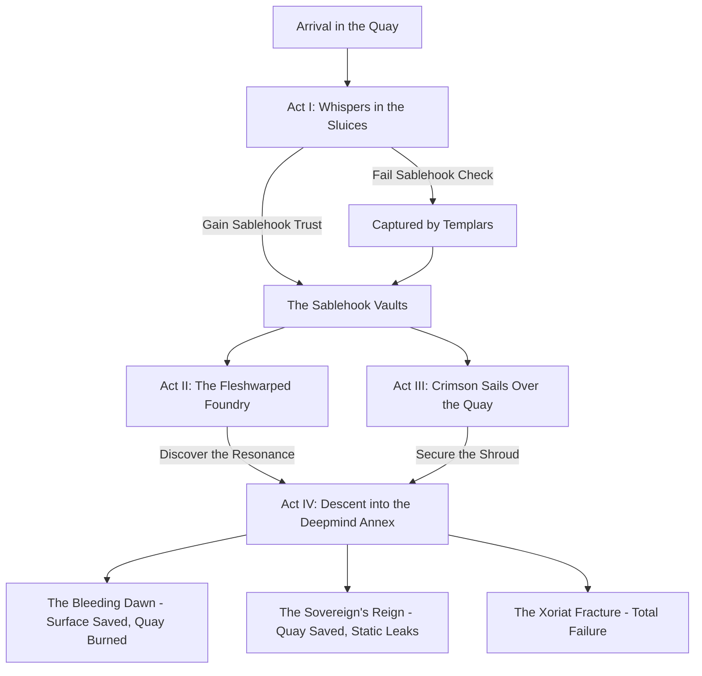

# Blackwater Quay: Campaign Flowchart

To assist Game Masters in navigating the non-linear structure of Blackwater Quay, use the following flowchart and milestone leveling guide.

## Visual Flowchart

## Milestone Leveling Guide
The campaign is designed to take characters from Level 5 to Level 10. Rather than tracking experience points (XP), characters level up upon completing significant narrative milestones.

*   **Level 5:** Characters begin the campaign at Level 5.
*   **Level 6:** Achieved upon completing **Act I**, successfully delivering the smuggled goods and earning an audience with Banki.
*   **Level 7:** Achieved after completing the first major faction questline (either dismantling a Thessalan Vat in **Act II** or repelling a Githyanki boarding party in **Act III**).
*   **Level 8:** Achieved after completing the second major faction questline (whichever Act the party did not complete for Level 7).
*   **Level 9:** Achieved upon breaching the Tri-Weave Shroud and entering the Deepmind Annex in **Act IV**.
*   **Level 10:** Achieved if the players survive the final confrontation at the Elder Node. 

## Failure States & Failing Forward
If the players "fail" an objective, the campaign does not end.
*   **Failing Act I:** If the players lose the smuggled goods, they are conscripted by the Templars as expendable scouts (Route `Alt1`), changing their starting faction from Sablehook to Covenant & Crown.
*   **Failing Act II/III:** If the players are defeated in the mid-game acts, they are captured. They must execute a prison break, but the enemy faction gains +2 Syndicate Victory Points, increasing the difficulty of Act IV.
