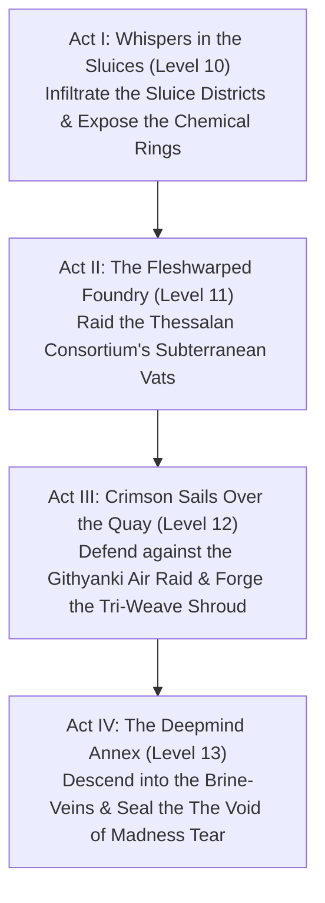

# The Deepmind Tear: Campaign Master Guide
## A TTRPG Adventure Arc for Levels 10–13 (D&D 3.5 / Pathfinder 1E)

---

## 1. INTRODUCTION & ADVENTURE BACKGROUND

### The Campaign Premise
*The Deepmind Tear* is a dark fantasy, planar-political campaign set in the damp, fog-shrouded streets and deep subterranean vaults of the city-state of **Blackwater Quay**. The campaign centers on an alliance of convenience between **Sablehook** (a criminal syndicate of biomantic outcasts and survivors of the Thessalan Consortium), **The Tarkanan's Marked Syndicate** (the Sharn-style aberrant dragonmark underworld), and the **Lords of Dust** (an ancient cabal of shape-shifting fiends). 

Together, they must prevent the **Elder Node**—a massive, subterranean mind flayer overmind—from opening a permanent rift to **The Void of Madness (the Realm of Madness)**. If the rift opens, the alien lords of flesh-warping, the Daelkyr, will break their seals and dissolve the region into formless chaos.

---

### History of the Thessalan Consortium's Downfall
The Thessalan Consortium was once a prestigious cabal of wizards and biomancers who operated deep-underground research labs beneath the Quay. They specialized in cross-breeding magical beasts and harnessing planar energy. Ten years ago, an experiment involving The Void of Madness bleeding went horribly wrong. 

The planar radiation dissolved their primary containment cells, warping the researchers into compliant thralls and unleashing the Elder Node's telepathic net. The survivors of these experiments—a mixture of spliced humanoids, fey, and aberrations—banded together under the leadership of Banki to form **Sablehook**, occupying the old foundations and swearing to prevent another planar tear.

---

### The Role of Banki and Kael
*   **Banki (The PixIllithid):** The leader of Sablehook. Originally a fey pixie, he was subjected to agonizing neural splicing by the Thessalan Consortium, merging his biology with an illithid. However, he is *not* connected to the Elder Brain's hive mind. Instead, he and the other survivors share a closed-loop collective consciousness. Banki's implement, the **Null-Fang**, channels the **Tri-Weave** (arcane, psionic, divine) to negate spells and psionics.
*   **Captain Mikhailis Vael-Kaelor (Kael):** The "Sovereign Corsair" and "Severing Edge" of the Vael-Kaelor clan. A towering, half-minotaur fey monstrosity with phase-shifting wings, displacer tentacles, and eldritch claws. He leads a corsair flotilla from his flagship, the *Onyx Wake*. While he mockingly wears the title "Auditor" to humor his brother Banki's rigid mindset, Kael is a brutal, chaotic pirate. His fractured chronal sense (gained from The Void of Madness exposure) allows him to read gravity and time distortions, making him the only guide capable of navigating the Deepmind Annex.

---

### The Elder Node's Shadow (Daily Intrusion Table)
To simulate the ever-present threat of the Elder Node's telepathic net, the DM rolls **1d20** at the start of each in-game day. This determines how the overmind's network disrupts the characters:

| Roll (1d20) | Event | Mechanical Effect |
| :--- | :--- | :--- |
| **1–5** | *Quiet Timeline* | The Elder Node is quiet, focusing its energies on the rift core. No intrusion occurs. |
| **6–9** | *Psychic Whisper* | Telepathic static echoes in the players' minds. All characters must succeed on a DC 14 Will save or take a -1 penalty to Initiative and Charisma-based checks for the next 24 hours. |
| **10–12** | *Gravity Distortion* | The local gravity fluctuates. For 1d4 hours, characters move at a +10 ft. bonus to speed, but suffer a -2 penalty on melee attack rolls as they float off the stone. |
| **13–15** | *Compliance Sweep* | The Choir of the Below sends hunters. The next combat encounter is joined on Round 3 by **1d4 Compliant Sewer Enforcers** seeking to capture the party. |
| **16–18** | *Fleshwarped Flare* | A localized wave of planar energy erupts. Living creatures within 30 ft. of the surge must succeed on a DC 16 Fortitude save or take 1d4 points of Dexterity damage as their joints temporarily fuse. |
| **19–20** | *Mind Blast Beacon* | The party triggers a psychic alarm. A strike team consisting of **2 Dolgaunts** and **1 Thessalan Displacer Beast** ambushes them within 1d4 hours. |

---

## 2. CAMPAIGN STRUCTURE & ACTS

The campaign is structured into four distinct acts, taking the characters from street-level investigations to a high-stakes planar siege.

---

### ACT I: WHISPERS IN THE SLUICES (Level 10)
*   **Goal:** Discover how the Elder Node is manipulating the city's surface.
*   **Summary:** The characters are hired by Sable (Banki's tactical commander) to investigate a series of kidnappings in the Northern Sluices. They discover that a local cult, the **Choir of the Below**, is distributing "Elder Node derivative compounds" to chemically comply the populace. By working with The Tarkanan's Marked Syndicate scouts, the party traces the supply line to a flooded sewer vault, where they defeat the Node's surface avatar, uncovering plans for a planar rift.

#### Boxed Text (Read-Aloud Scene):
> *The air in the Northern Sluices is thick with the stench of vinegar, rotting refuse, and sulfurous sewage gas. Sludge overflows the stone gutters, weeping down from the brick vaults above in greasy streaks. Below the hanging wooden shacks of the city's outcasts, you can hear the telepathic resonance—a low, rhythmic thrumming that vibrates in the back of your skull. Red, glowing sigils of the Choir of the Below are painted on the iron lock doors, marking the entry to the flooded vaults.*

*   **Encounter Outline:**
    *   *Encounter I-1:* Sluice Blockade (4 Sewer Thugs, 2 Compliant Thralls; CR 10).
    *   *Encounter I-2:* The Acidic Locks (Sewage hazard, 1 Thessalan Displacer Beast prototype; CR 11).
    *   *Encounter I-3:* Cult Altar (1 Choir Priest, 2 Dolgaunt Cell-Guards; CR 12).
*   **Tactical Environment:** Flooded walkways. Combatants must succeed on a DC 14 Balance check to run. Slipping causes the character to fall into the 5-ft deep sludge channels, dealing 1d6 points of acid damage and exposing them to sewer rot.

---

### ACT II: THE FLESHWARPED FOUNDRY (Level 11)
*   **Goal:** Destroy the Thessalan Consortium's local stronghold and secure their biological suppressants.
*   **Summary:** The Thessalan Consortium has established a secret "Fleshwarped Foundry" in the Belowmarket Deep, breeding mutated displacer-beasts and war-beasts. The characters must coordinate a diversionary surface riot with The Tarkanan's Marked Syndicate while Kael's boarding crew (led by the alchemist Suture and first mate Dreadjaw Rellis) holds the surrounding canal vectors. Infiltrating the foundry, the characters must destroy the growth vats and secure the Consortium's research journals containing the formulas needed to neutralize the Elder Node's secretion chains.

#### Boxed Text (Read-Aloud Scene):
> *The Belowmarket Deep opens into a gargantuan cavern illuminated by volcanic fissures. Amidst the duergar forges and crowded market stalls, a dark basalt fortress looms over the green-sludge canal vectors. Heavy copper pipes run along the exterior walls, pulsing with glowing green chemical slurries. The iron gates are locked, and from the security grates above, the smell of burnt hair and chemical acid drifts over the docks. Steam whistles from venting valves, echoing like the breathing of a massive beast.*

*   **Encounter Outline:**
    *   *Encounter II-1:* Canal Gates (4 Consortium Guards, 1 Mutated Sea-Wolf; CR 11).
    *   *Encounter II-2:* The Vat Room (Vespera the Fleshwarper, 2 Thessalan Displacer Beasts; CR 12).
    *   *Encounter II-3:* The Archives (1 Flesh Golem prototype, 2 Dolgaunts; CR 12).
*   **Tactical Environment:** Growing vats. The room is filled with large glass cylinders. Hitting a canister (AC 10, HP 15) shatters it, releasing green acid in a 10-ft radius (dealing 3d6 acid damage and spawning a mutated crawling claw natural hazard).

---

### ACT III: CRIMSON SAILS OVER THE QUAY (Level 12)
*   **Goal:** Defend Sablehook from a Githyanki air raid and steal the displacement shield technology.
*   **Summary:** A Githyanki raiding fleet attacks Blackwater Quay, hunting down the deserter Zaniph, the rift-sealer Kaelen Grey, and the "aberrant" fey pirate Kael. As Githyanki spelljamming galleons rain psychic fire, The Tarkanan's Marked Syndicate grounds their skiffs and Terik (the rakshasa) projects a displacement shield over the harbor. The party must defend Sablehook's walls alongside Kael's crew. Inside the vaults, Kaelen Grey ("Suture") scans the shield's stressed runes, allowing Banki to reverse-engineer it. The act ends with a daring boarding action on the flagship, *Vlaakith's Pride*, launched from the deck of Kael's flagship, the *Onyx Wake*. Banki uses the contract loophole to keep the silver sword, triggering the **Tri-Weave Shroud** to hide Sablehook.

#### Boxed Text (Read-Aloud Scene):
> *The ceiling of the subterranean harbor cracks as three massive Githyanki spelljamming galleons break through the upper rock strata. Their silver hulls catch the green glow of the quay's alchemical lights, and from their ballista ports, psychic fire rain down onto the stone docks. Sablehook’s bells ring in alarm. The harbor water churns as Captain Mikhailis's flagship, the Onyx Wake, pivots to intercept, its sails of dark fey-metal catching the air. From the sky, Githyanki raiders slide down ropes, their silver blades drawing arcs of light in the fog.*

*   **Encounter Outline:**
    *   *Encounter III-1:* Harbor Walls (4 Githyanki Raiders, 1 Red Dragon Wyrmling; CR 12).
    *   *Encounter III-2:* Flagship Boarding (Commander Zaniph's former captain, 3 Githyanki Knights; CR 13).
    *   *Encounter III-3:* The Shroud Core (Defending Banki from Githyanki astral stalkers; CR 13).

#### Siege of Sablehook Victory Tracker
During the Githyanki air raid in Act III, the party accumulates **Victory Points (VP)** based on their tactical successes. The final tally determines the condition of the survivors and starting assets in Act IV:

*   **VP Opportunities:**
    *   *Activate the Shroud:* Complete the shield scan and start the Tri-Weave Shroud (**+3 VP**).
    *   *Deploy Tarkanan Snipers:* Secure the harbor towers (**+2 VP**).
    *   *Repel the Harbor Boarders:* Lead Kael's sailors to protect the fleet docks (**+2 VP**).
    *   *Defeat the Githyanki Commander:* Slay Commander Zaniph's former captain on the deck of the *Pride* (**+4 VP**).
    *   *Protect the Ritualists:* Prevent Kaelen Grey or Banki from taking damage during the scans (**+2 VP**).

*   **Campaign Outcomes:**
    *   **11+ VP (Epic Victory):** Sablehook stands tall. The Tri-Weave Shroud works at 100% efficiency. The players begin Act IV with full supplies, a +2 bonus on all faction renown tracks, and a **Chronal Chronometer** already in their inventory.
    *   **7–10 VP (Pyrrhic Victory):** Sablehook is damaged. Several of Kael's crew are wounded. The Shroud flickers. The players must spend 3,000 gp in supplies to repair the docks, and their starting renown is unmodified.
    *   **6 or less VP (Disastrous Retreat):** Sablehook is overrun. The harbor burns. Survivors retreat into the deep caverns. In Act IV, all characters start with a permanent *fatigued* condition due to sleep deprivation and minor injuries, which cannot be removed until they reach the Cathedral of Whispers.

---

### ACT IV: THE DEEPMIND ANNEX (Level 13)
*   **Goal:** Seal the The Void of Madness Tear and survive the rakshasa double-cross.
*   **Summary:** Compiled as a standalone module (*Act_IV_Descent_into_the_Deepmind_Annex*). The party descends into the brine-veins, navigates the gravity flues, completes the sealing ritual while combating the dragon Oraxis, and utilizes Kael's temporal loop to reverse Hruujj's betrayal.

---

## 3. ADVENTURE HOOKS & PLAYER MOTIVATIONS

*   **The Aberrant Mark Hook (Tarkanan):** One or more PCs bear aberrant dragonmarks. The proximity of the The Void of Madness rift is causing their marks to weep blood and discharge erratic magic. To save their own lives, they must help Sablehook seal the tear.
*   **The Planar Scholar Hook (Lords of Dust):** The PCs are contacted by a disguised rakshasa who offers them access to ancient draconic prophecy fragments if they help a local "syndicate" (Sablehook) deal with an extraplanar threat in the harbor.
*   **The Escapee Hook (Consortium):** The PCs are former test subjects who escaped the Thessalan Consortium's annex along with Banki. They must protect their new sanctuary (Sablehook) from being reclaimed.

---

## 4. MILESTONE PROGRESSION & WEALTH BY LEVEL (WBL) INDEX

To ensure a balanced campaign, character progression and treasure distribution are indexed to standard D&D 3.5 / Pathfinder WBL progression:

### Milestone XP Pacing
*   **Start of Campaign:** Characters begin at **Level 10**.
*   **End of Act I:** Level up to **Level 11** upon defeating the surface avatar in the Northern Sluices.
*   **End of Act II:** Level up to **Level 12** after destroying the growth vats in the Fleshwarped Foundry.
*   **End of Act III:** Level up to **Level 13** after boarding *Vlaakith's Pride* and sealing the harbor.
*   **Act IV Climax:** Reaching the end of the campaign at Level 13.

### Wealth By Level (WBL) Target Progression
*   **Level 10 (Start):** 49,000 gp starting gear.
*   **Level 11 (Act II):** 66,000 gp. 
    *   *Key Item Found:* **Formula of Thessalan Suppressants** (Allows Suture to brew 3 free healing mutagens).
*   **Level 12 (Act III):** 88,000 gp. 
    *   *Key Item Found:* **Tri-Weave Silver Blade** (+3 silver short sword that ignores spell and power resistance).
*   **Level 13 (Act IV):** 110,000 gp.
    *   *Key Item Found:* **The Null-Fang** (Wielded by Banki; anchors the Sovereign Thread. Grants PCs access to its magic negation field).
