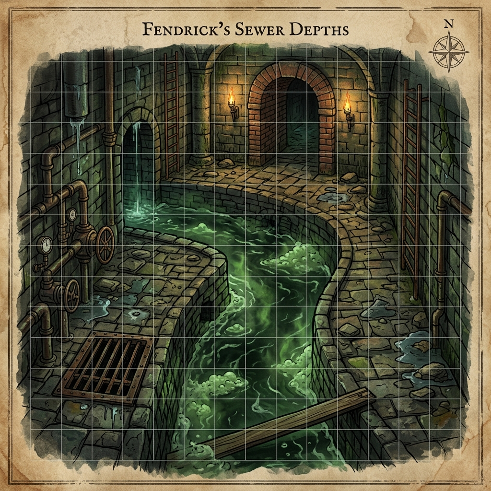
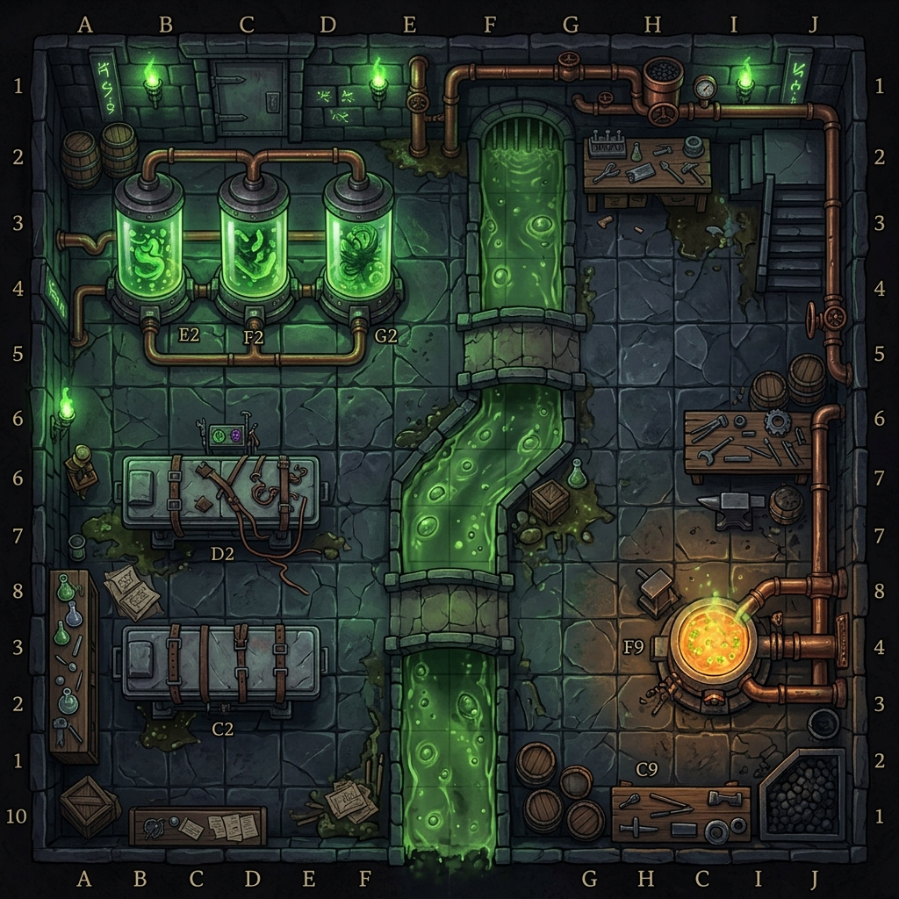

# Campaign Locations & Encounter Keys: The Subterranean Vaults
## Dungeon Maps, Hazards, and Room Keys

---

## 1. THE NORTHERN SLUICES (Act I Sewer Crawl)

*The sewers beneath the Northern Sluice District are a labyrinth of wet stone, iron grates, and flooded conduits. They have been occupied by the Choir of the Below, who use them to distribute the Elder Node's chemical compounds.*

### Room Keys

#### S-1: The Sluice Gate
*   **Boxed Text:**
    > *A heavy iron gate blocks the mouth of the sewer canal, its bars encrusted with green rust and black slime. Beyond the gate, the vaulted stone ceiling arches over a narrow stone walkway slick with green moss, flanked by a deep channel of sluggish, dark water. Two figures in stained leather aprons stand on the walkway, holding iron-tipped spears and lanterns that cast long, dancing shadows on the brick walls.*
*   **Encounter:** **2 Compliant Thugs** (Sentry guards).
*   **Trap: Pipe Flush Tripwire:** A thin cord stretched across the walkway (Search DC 15 to spot). If tripped, a pressure valve opens, flushing acidic sewage gas from a side pipe in a 10-ft cone. All targets in the area must succeed on a DC 15 Reflex save or be knocked prone into the canal and take 2d6 acid damage.
*   **Loot:** Sluice key ring, 15 gp, 1 flask of low-grade alchemical oil.

#### S-2: Drainage Pipe
*   **Boxed Text:**
    > *The passage narrows here, forcing you into a low, circular stone conduit. The walkway disappears beneath knee-deep, foul-smelling water that flows with sluggish force. The air is stagnant, warm, and carries a faint sweet scent that burns the nostrils—the unmistakable smell of sewer gas trapped in the masonry.*
*   **Hazard: Sewer Gas:** Any open flame (torches, fire spells) triggers an immediate explosion in the 60-ft pipe corridor. All creatures must make a DC 15 Reflex save, taking 3d6 fire damage on a failure (half on success). The explosion alerts the vaults.
*   **Terrain:** Slippery moss. Running requires a DC 15 Balance check; failure results in falling prone in the sewage water.

#### S-3: The Distribution Vault
*   **Boxed Text:**
    > *The narrow pipe opens into a wide, vaulted brick chamber supported by thick stone pillars. Wooden platforms are built over the deep sewer channels, crowded with crates, scales, and alchemical distillation glass. At the center of the room, a priest in robes of deep violet stands over a boiling copper vat, chanting in a discordant telepathic tongue as he pours glowing blue droplets into glass vials.*
*   **Encounter:** **1 Choir Cleric** and **3 Compliant Enforcers**.
*   **Tactics:** The cleric stands behind the pillars, casting *Command* and *Doom* on the party while the enforcers block the wooden walkways. On Round 2, the cleric throws a vial of *Acidic Mutagen* (splash weapon, 2d6 acid).
*   **Loot:** 3 crates of Blue-Drop (15 vials total worth 2,250 gp on the black market), a locked strongbox containing 400 gp in ancient Dhakaani coinage.

#### S-4: Scribe's Den
*   **Boxed Text:**
    > *A dry, brick-lined side chamber that served as a dwarven control room. Metal desks are covered in parchment ledgers, trade manifests, and maps of the city's underbelly. A faint blue glow emanates from a warded drawer on the main desk.*
*   **Lore Secret:** Investigating the desk manifests (Search DC 18) reveals that the Choir is receiving massive gold shipments from a tiefling merchant named Terik, linking the operation directly to the Belowmarket Deep.
*   **Loot:** *Lens of Detection*, scroll of *Disguise Self*, journal detailing the Choir's activities, and 150 gp.

---

## 2. THE FLESHWARPED FOUNDRY (Act II Dungeon)

*The Thessalan Consortium's subterranean stronghold is constructed from ancient dwarven ruins, reinforced with brass pipes, copper vats, and lead-lined containment cages.*

### Room Keys

#### F-1: The Lift Chamber
*   **Boxed Text:**
    > *The stone corridor ends at a massive, circular shaft. A platform of rusted iron plates and brass gears hangs from thick iron chains. A series of heavy copper pipes run down the walls, venting hiss of steam, and a large iron wheel controls the water valves that operate the lift.*
*   **Puzzle: Valve Override:** The lift wheel is locked by a heavy chain. A character can pick the lock (Open Locks DC 20) or manually turn the wheel with a DC 22 Strength check. Turning the wheel manually takes 2 rounds and attracts guards from F-2 due to the squealing gears.

#### F-2: Guard Barracks
*   **Boxed Text:**
    > *This rectangular stone chamber is lined with iron bunks and weapon racks. The walls are covered in blueprints of mutated beasts. A large iron brazier at the center of the room burns coal, casting a red glare over the stone floor.*
*   **Encounter:** **4 Consortium Sentries** and **1 Splicer Assistant**.
*   **Tactics:** The sentries form a shield wall to block the door, while the assistant throws alchemical flash powder (DC 15 Fortitude save or be blinded for 1 round).
*   **Loot:** Guard sergeant's key (unlocks F-1 and F-3), 120 gp, and 2 potions of *Cure Moderate Wounds*.

#### F-3: Testing Pens
*   **Boxed Text:**
    > *The smell of wet fur, iron, and chemical acid is overwhelming. The corridor is lined with heavy iron cages. Inside, shifting blue shapes pace behind the bars, their tentacles twitching against the metal doors.*
*   **Encounter:** **1 Thessalan Displacer Beast prototype**.
*   **Mechanic: Release Lever:** The guards in F-2 will pull a wall lever to release the beast if they are losing the fight. A rogue can disable the release mechanism (Disable Device DC 18) to keep the cages locked.

#### F-4: The Vat Room
*   **Boxed Text:**
    > *A massive, multi-tiered chamber dominated by four glowing green copper vats. Copper pipes run from the ceiling, dumping raw organic slurries into the bubbling liquid. A tiefling woman with biological grafts covering her arms stands on a raised metal walkway, holding a glowing wand and barking orders at her assistants.*
*   **Encounter:** **Dr. Vespera Thran** (level 9 transmuter/fleshwarper) and **2 Splicer technicians**.
*   **Tactics:** Vespera casts *Haste* on her assistants and uses *Web* to trap characters on the walkways. If cornered, she uses her wand to rupture a vat valve, spraying mutagenic acid onto the floor (dealing 2d6 acid damage per round to anyone not on a walkway).
*   **Loot:** *Ring of Acid Resistance 10*, Vespera's spellbook (containing all her transmutation spells), and 1,200 gp in biomantic components.

#### F-5: Mikhailis' Old Laboratory
*   **Boxed Text:**
    > *A quiet, warded sanctuary filled with dusty bookshelves, glass jars containing biological specimens, and a large iron desk. The walls are etched with glowing silver runes that hum with abjuration magic.*
*   **Puzzle: Fey Silver Lattice Sigil:** The door is locked by Kael's private sigil. A caster must cast a Transmutation spell or manifest a physical psionic power to activate the sigil, or succeed on a DC 25 Knowledge (Arcana) check to bypass the ward.
*   **Loot:** **Consortium Research Journals** (outlining the Elder Node's compliance formulas), shards of the **Tri-Weave Silver Blade**, and 3 flasks of *Troll-Blood Serum* (heals 3d8+5 HP and grants Fast Healing 1 for 1 minute).

---

## 3. THE DEEPMIND ANNEX (Act IV Standalone)
*   **Note to Dungeon Master:** The cavern maps, non-Euclidean hazards, room keys, and climax encounters for the final act are detailed in the standalone module: **[Act_IV_Descent_into_the_Deepmind_Annex.pdf](file:///H:/Antigravity/Novel/Campaign_Module/Act_IV_Descent_into_the_Deepmind_Annex.pdf)**.
