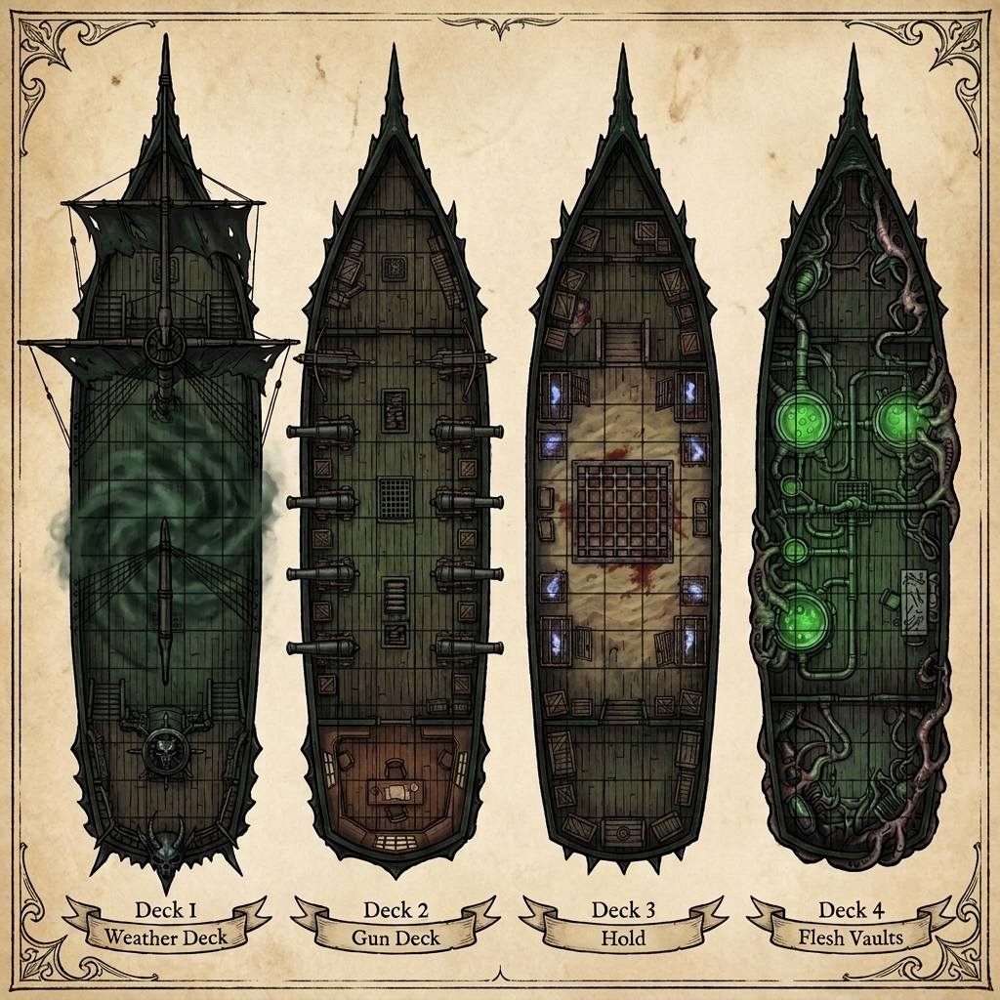
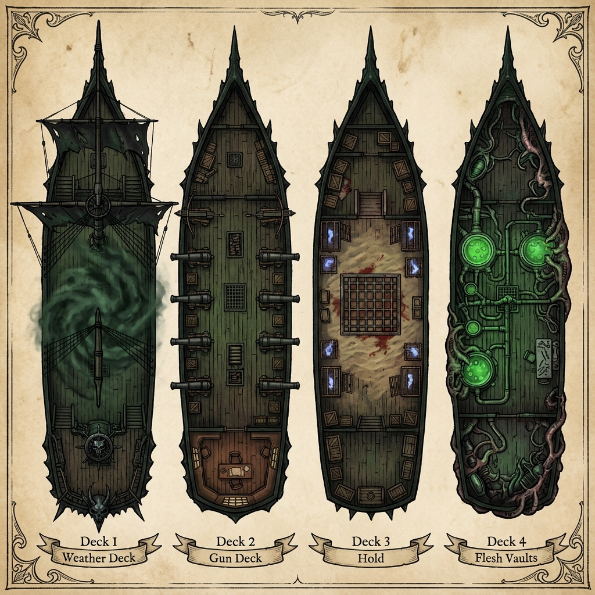
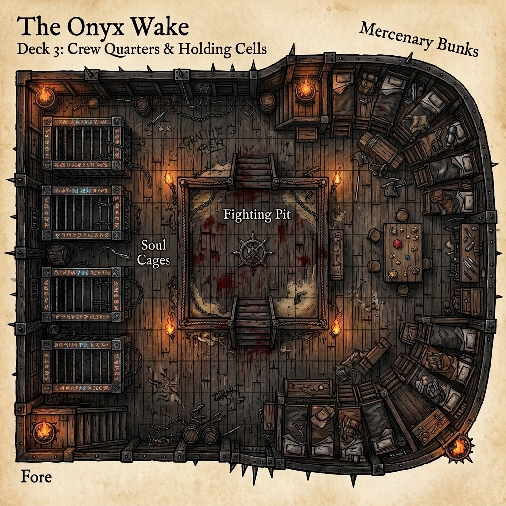
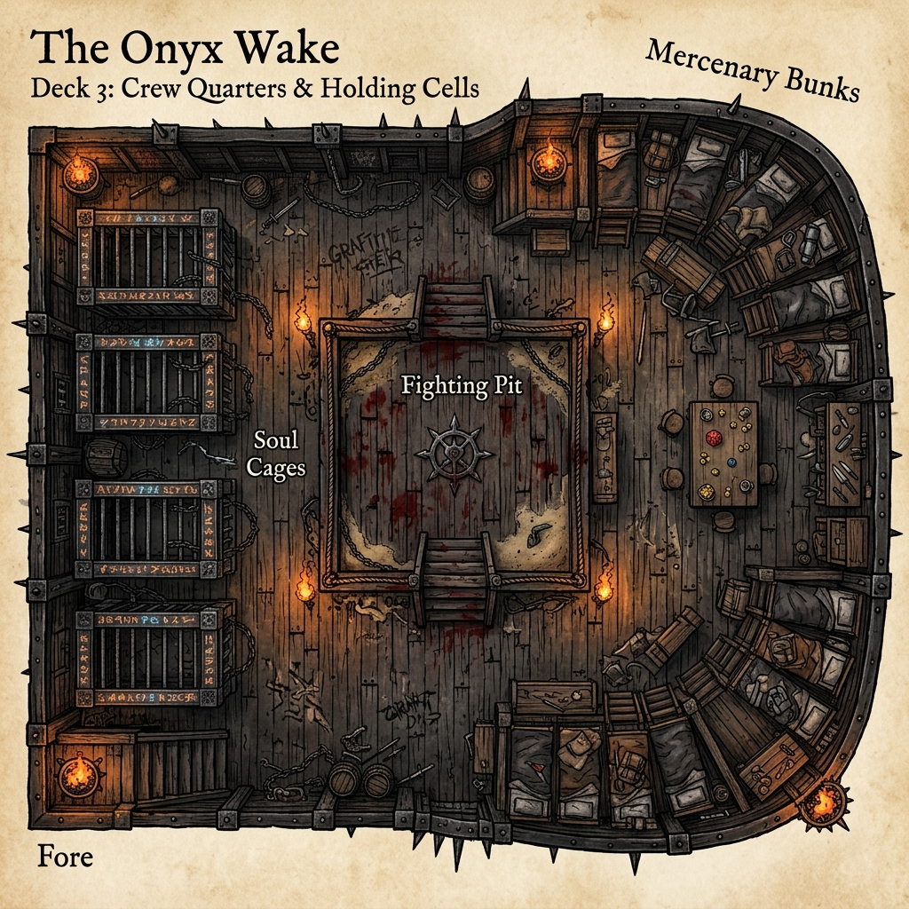
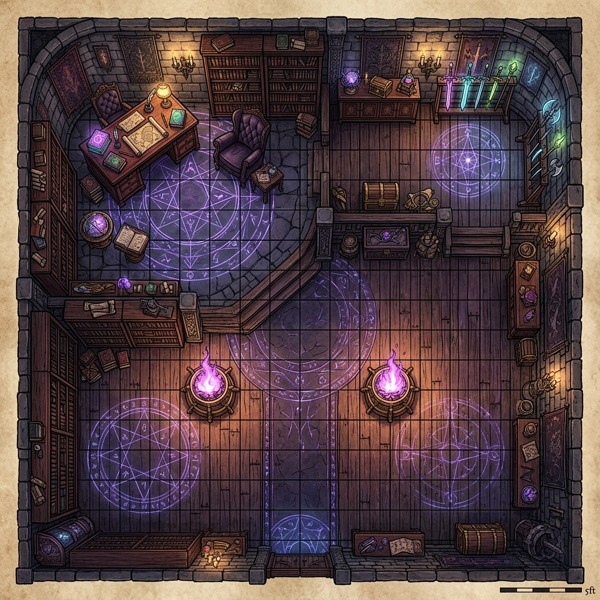
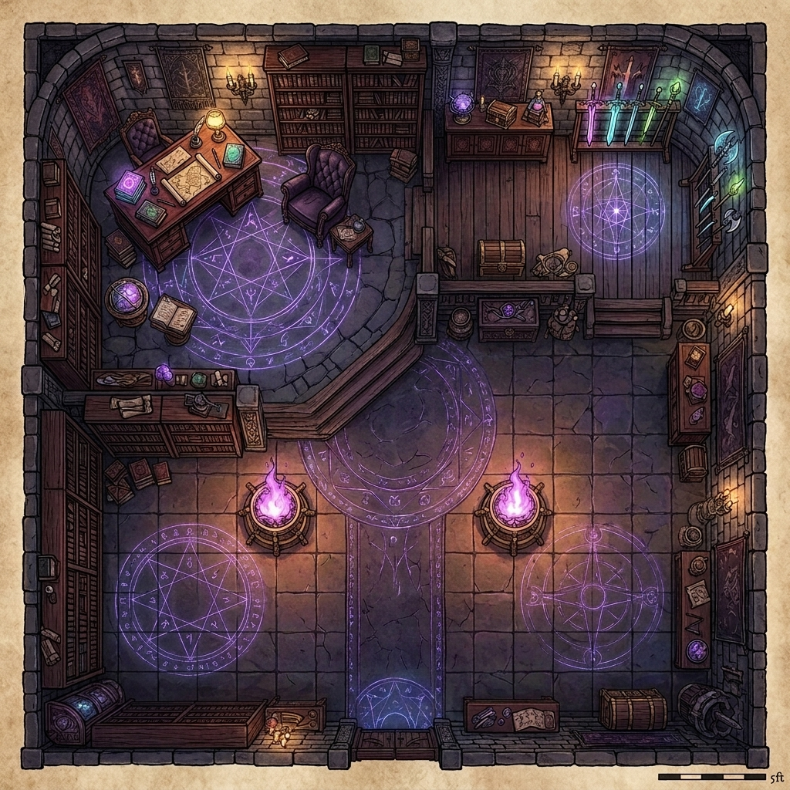

# Captain Kael's Flagship: The Onyx Wake
## Complete TTRPG Vehicle Manual, Armament Catalog & Tactical Guide
### System Compatibility: D&D 3.5 / Pathfinder 1E
### The Sovereign Spearhead of the Vael-Kaelor Corsair Flotilla

The *Onyx Wake* is the absolute dreadnought—the "Death Star" of the Blackwater Quay fleet. It is a colossal mobile fortress engineered specifically for fleet interception, heavy siege operations, and reality-warping battlefield control. While Suture's ship, *The Bleeding Needle*, serves as a quiet mobile laboratory and surgical sanctuary, the *Onyx Wake* is a weapon of direct, terrifying violence. 

Sheathed in brutalist iron plating, fused demon-bone, and weeping necrotic wood, the ship weeps a constant trail of thick, black necrotic oil directly into the pitch-black Underdark currents. Powered by the agonizing vibrations of a planar soul-combustion engine and wielding a devastating battery of Tri-Weave (Arcane, Psionic, and Divine) weaponry, the *Onyx Wake* stands as the crowning achievement of the Vael-Kaelor clan's defiance against the Thessalan Consortium.

---

## 1. VESSEL SPECIFICATIONS & INFRASTRUCTURE

```
        +-------------------------------------------------------+
        |                  THE ONYX WAKE                        |
        +-------------------------------------------------------+
        |  [DECK I: WEATHER DECK] -> Spinal Masts & Helm       |
        |  [DECK II: GUN DECK]    -> Cursed Cannons & Quarters  |
        |  [DECK III: HOLD]       -> Pit, Bunks & Soul Cages    |
        |  [DECK IV: BLACK LABS]  -> Hybridization Vats & Labs  |
        |  [CORE / KEEL]          -> Soul Engine & Sphere Spine |
        +-------------------------------------------------------+
```

*   **Vessel Class:** Abyssal Dread-Carrier / Heavy Ironclad Dreadnought / Stygian Privateer
*   **Dimensions:** 260 ft. long, 55 ft. wide, drawing 26 ft. of water.
*   **Hull Armor:** Reinforced Brutalist Iron Plating over a frame of fossilized kraken-bone and weeping necrotic wood. 
    *   *Hardness:* 20; **HP:** 1,200 (Break threshold 400).
    *   *Rigging HP:* 200; **Overall AC:** 24 (-8 size, +22 natural/iron plating).

### Tactical Battlemaps

#### Decks 1, 2 & 4 (Master Map)
##### Grid Version


##### No-Grid Version


#### Deck 3: Crew Quarters & Holding Cells (Mercenary Bunks & Fighting Pit)
##### Grid Version


##### No-Grid Version


#### Captain's Quarters (The Sovereign's Sanctuary - Extra-Dimensional Space)
##### Grid Version


##### No-Grid Version


*   **Propulsion Systems:**
    1.  **Planar Soul-Combustion Engine:** The ship does not sail on wind or steam. Deep within the keel, a massive furnace burns the residual spiritual energy of captured enemies. The internal memory-combustion engine hums with the agonizing vibration of planar soul-combustion, driving heavy copper paddle-screws that propel the ship against any current.
    2.  **Spinal Masts & Shadow Sails:** Two massive masts constructed from the fused spinal columns of slain subterranean giants. They are rigged with sails of ragged, light-devouring shadow-weave cloth that catch planar winds and subterranean thermal drafts.

---

## 2. DECK-BY-DECK ARCHITECTURE

### DECK I: THE WEATHER DECK (THE MAIN DECK / KILLING FLOOR)
The uppermost deck is built exceptionally wide and open, specifically designed to serve as a clearing floor for violent boarding actions. It measures 140 feet long by 40 feet wide.
*   **Atmosphere:** The deck is perpetually shrouded in a sickly green Stygian mist that clings to the boots. The entire space is illuminated by pale purple Hellfire rising from three heavy iron braziers. Patches of the deck timber are permanently slick with congealed blood and river slime.
*   **The Helm:** Elevated 10 feet on a raised aft quarterdeck. The ship’s wheel is forged from a massive, multi-horned demon skull. The handles are the demon's cracked horns, polished smooth by Kael’s clawed hands.
*   **The Eternal Sentinel (The Mainmast):** The mentally hollowed body of the drow commander **Valas Noquar** is melded directly into the vertebrae of the giant-spine mainmast. Fused via the Brute Tri-Weave, he acts as a living sensor array and autopilot coordinator, his empty eyes staring forward as his mind reads the surrounding water and stone.

### DECK II: THE GUN DECK & CAPTAIN'S CABIN
The tactical heart of the vessel, measuring 120 feet long by 40 feet wide. It is cramped, loud, dark, and filled with the smell of sulfur and damp iron.
*   **Atmosphere:** The only ambient light filters through the narrow 1-foot-wide gunports and a single rusted lantern hanging from the center beam. The port and starboard channels are considered **difficult terrain** due to loose mooring chains, rolling iron shot, and discarded powder kegs that shift with the vessel's movement.
*   **The Captain's Quarters (The Sovereign's Sanctuary):** Located at the absolute aft, behind a heavy, rune-carved iron door. The threshold is warded by a permanent **Extra-Dimensional Spatial Enchantment** (a custom Tri-Weave folding weave). Stepping inside reveals a chamber that expands far beyond the physical constraints of the ship's hull, presenting a vaulted 60x60 foot private sanctuary of dark, stolen opulence. It features floor-to-ceiling library shelves of ancient planar lore, a massive mahogany desk, a velvet-lined armchair, glowing planar star charts, and weapon racks displaying captured magical blades. The space is completely insulated from the rest of the vessel's mechanical soul-combustion vibrations and ambient planar noise.

### DECK III: CREW QUARTERS & HOLDING CELLS
The living space for the ship's violent crew, measuring 100 feet long by 35 feet wide.
*   **Atmosphere:** The air is warm, stale, and smelled of wet fur and sour ale. The deck is lit only by smoldering coals in corner braziers.
*   **The Fighting Pit:** A 15x15 foot black-stained wooden ring situated directly in the center of the deck. Disputes between the corsairs are settled here by fist or blade, with the crew gathering around the rails to gamble.
*   **Mercenary Bunks:** Located aft, featuring tiered, filthy canvas cots, grinding stones for sharpening blades, and a warped table stained with grease where the crew plays dice and cards.
*   **The Soul Cages:** Positioned at the fore of the deck. Heavy, cold-iron cages etched with divine containment runes. These cages are designed to hold captured spellcasters and extraplanar entities before they are fed into the soul-combustion engine below.

### DECK IV: THE BLACK LABS / FLESH VAULTS
The lowest deck, serving as the surgical atelier of the darkwood flesh-stitcher, **Suture**.
*   **Atmosphere:** Stained with preservative brine and alchemical run-off. This deck acts as a workspace for monstrous hybridization. Here, Suture performs biomantic grafts and implants alchemical fuel sumps into war-beasts like **Trench the Scrag**, turning them into armored, regenerating line-breakers for the corsair fleet.

---

## 3. SOVEREIGN ARMAMENTS & TRI-WEAVE WEAPONRY

The *Onyx Wake* is outfitted with an array of reality-bending weapons that fuse arcane transmutations, psionic telekinesis, and divine blood-magic.

### A. The Sovereign Anchor Core
A massive **Adamantine Sphere** has been surgically sutured into the ship's primary structural spine in the keel. 
*   **TTRPG Mechanics:** The sphere distorts the surrounding water, creating a perpetual displacement effect that gives the *Onyx Wake* a +4 deflection bonus to AC. Furthermore, it grounds the vessel against reality-warping magic. The ship is completely immune to *dimensional anchor*, *teleport block*, and any gravity-altering spells unless the sphere itself is targeted and deactivated.

### B. The Gravitic Singular-Ram (Prow Weapon)
The prow of the dreadnought is shaped like a massive, jagged mandible of black ironwood and obsidian. Instead of a static spike, it channels the mass-control properties of the Adamantine Sphere to manipulate local gravity at the point of impact.
*   **TTRPG Mechanics:** Upon executing a ramming action, the helmsman activates the prow, momentarily increasing the ship's effective mass by a factor of fifty and inducing a localized gravity collapse. The ram deals **20d6 bludgeoning and gravity damage** (ignoring up to 20 points of target hardness). The target vessel must succeed on a DC 25 Reflex save or have its hull structural framing fold inward, pinning it to the *Onyx Wake*'s jaw and throwing all crew on deck prone.

### C. The Sovereign Void-Lapse Lance (The Superweapon)
Mounted on the bowsprit, this devastating siege weapon is a fusion of the **Resonance-Amplified Array** and the **Sovereign Soul-Burner**. It braids absolute cold void energy with transmutative fire into a single, ship-breaking beam of destruction.
*   **TTRPG Mechanics:** The lance requires a full round to charge, drawing power directly from the soul-combustion engine. As a standard action, it fires a **300-ft. line, 10 ft. wide**. All creatures and objects in the path take **15d6 disintegrate damage** (Reflex DC 22 half). Vehicles and structures take **double damage (30d6)** and ignore all hardness. Any creature slain by the lance has its soul instantly siphoned into the ship's fuel cells. The lance can be fired once every 10 minutes (100 rounds).

### D. The Infernal Batteries
Six demonic, brass-cast cannons positioned with three on the port side and three on the starboard side of Deck II.
*   **TTRPG Mechanics:** The cannons are possessed by minor fire-demons. They fire heavy iron shot coated in hellfire. 
    *   *Attack:* Ranged +8 (range increment 150 ft.).
    *   *Damage:* 6d6 bludgeoning and fire damage. On a hit, the target ship must make a DC 18 Will save or be afflicted with the **Curse of the Shadow-Weave**, causing the target vessel's sails or rigging to take 2d6 cold damage each round and introducing a 50% spell/power failure rate to anyone casting or manifesting aboard the victim ship for 1 minute.

### E. Boarding Harpoons
Four heavy, winch-loaded harpoon ballistae lining the port and starboard rails of Deck I, sitting beside piles of thick iron chains.
*   **TTRPG Mechanics:** 
    *   *Attack:* Ranged +10 (range increment 100 ft.).
    *   *Damage:* 3d8 piercing damage. On a hit, the target vessel is grappled by the heavy iron chains. Winding the windlasses (requiring two crew members or one monstrous construct) drags the target vessel 30 feet closer to the *Onyx Wake* at the start of each of the dreadnought's turns.

---

## 4. THE COMMAND TRIAD & CREW ROSTER

### A. The Command Triad
1.  **Captain Mikhailis Vael-Kaelor (Kael — Sovereign Corsair):**
    *   *Role:* Fleet Commander and Helmsman.
    *   *Visual:* A towering, 8-foot-tall half-minotaur fey monstrosity with phase-shifting wings, displacer tentacles, and eldritch claws. He steers the ship with a wild, manic laugh, his chronal senses aligned with the ship's *Sovereign Anchor* to feel gravity fluctuations.
2.  **First Mate Dreadjaw Rellis (CR 14 Orc Enforcer — Barbarian 12 / Fighter 2):**
    *   *Role:* Deck Commander and Boarding Leader.
    *   *Visual:* Originally the fragile-jawed dockworker "Glassjaw Rellis," he was rebuilt through Suture and Kael's experimental Tri-Weave surgery. Now a massive, armored Orc enforcer whose lower face is a brutal fey-metal plate pulsing with psionic and necrotic energy. He charges at the front of boarding actions with a heavy greataxe, releasing sonic Dread-Shouts to shatter enemy lines and using his metallic jaw to chew through and absorb the magic of opposing spellcasters.
3.  **The Eternal Sentinel (Commander Valas Noquar):**
    *   *Role:* Mainmast Sensor / Helmsman Proxy.
    *   *Visual:* A drow commander in worn leather armor, his lower limbs and spine completely grown into the wood of the mainmast. His eyes are blank white spheres, and his mouth twitches in silent calculations. He allows the ship to react instantly to subterranean threats.

### B. Core Officers & Specialists
*   **Chief Navigator Serris Vae (CR 11 Fey-Drow Chrono-Seer):** [Serris Vae character sheet](file:///h:/Antigravity/Novel/Campaign_Module/monsters.md#7-chief-navigator-serris-vae-fey-drow-chrono-seer--cr-11). A pale fey-drow Chronomancer who operates the *Hellfire Navigation Array* on the bridge, plotting paths through non-Euclidean coordinates.
*   **Chief Engineer Thrain Vrunn (CR 11 Duergar Steam-Smith):** [Thrain Vrunn character sheet](file:///h:/Antigravity/Novel/Campaign_Module/monsters.md#8-chief-engineer-thrain-vrunn-duergar-steam-smith--cr-11). A soot-covered duergar who manages the soul-combustion furnace in Deck III and can overload the boilers.
*   **Trench (Slake) the Scrag (CR 15 Vanguard / Frenzied Berserker):** [Slake character sheet](file:///h:/Antigravity/Novel/Campaign_Module/monsters.md#9-slake-trench-the-deep-trench-scrag-heavy-vanguard--frenzied-berserker--cr-15). A massive, armor-plated aquatic scrag upgraded by Suture to serve as a shipbreaker, wielding a black-steel Harpoon-Cannon.

### C. The Fleet Force
*   **30x Shadar-Kai Corsairs (CR 6):** [Shadar-Kai Corsair sheet](file:///h:/Antigravity/Novel/Campaign_Module/monsters.md#10-shadar-kai-corsair-sablehook-shock-trooper--cr-6). Cold, pragmatic shadow-fey pirates armed with spiked chains. Grafted with Phase-Stutter Skin (20% concealment, 10 ft. teleport 3/day) and Spinal Surge mindsight.
*   **15x Sea-Wolf Hybrids (CR 6):** [Sea-Wolf Hybrid sheet](file:///h:/Antigravity/Novel/Campaign_Module/monsters.md#6-sea-wolf-hybrid-sablehook-fleet-sentinel--cr-6). Mutated aquatic sentinels with Aqueous Camouflage (+8 Hide underwater), Thermal Nullification, electrified claws/bites, and adamantine chest plates.
*   **20x Skeletal Stokers:** Reanimated skeletal thralls bound to the furnace room on Deck III, shoveling coal, brimstone, and soul-shards into the boilers.

---

## 5. TTRPG CAMPAIGN MECHANICS & ABILITIES

### A. Flagship In-Game Upgrades & Modifications
*   **Sovereign Ascension (Living Construct Symbiosis):** Suture grafted the Abyssal Hunter-Squid directly into the ship's keel and Stygian fuel-intake. The *Onyx Wake* is now a **Living Construct**. Its iron hull pulses with a biological heartbeat, allowing Kael or the helmsman to command the ship telepathically as an extension of their own body. This grants a +4 bonus on handling checks and regenerates 2d6 points of hull damage per hour.
*   **The Sovereign Anchor (Adamantine Sphere Graft):** The Adamantine Sphere is mounted on the bow, serving as a localized reality-stabilizer and an unconventional gravitic weapon controlled by Kael's phrenic lattice:
    *   *Defensive Anchor:* Projects a **500-foot aura** that automatically blocks all enemy teleportation and planar-boarding tactics (e.g., *Dimension Door*, *Dimension Slide*, or psionic teleportation) to board the vessel.
    *   *Gravitic Singular-Ram:* During a ramming maneuver, Kael can instantly increase the ship's effective mass by a factor of fifty, inducing a localized gravity collapse at the point of contact. This deals **12d6 crushing damage** that completely ignores the target's armor class and hardness, folding the target's hull structure inward into the gravitational cavity.
    *   *Hydrodynamic Shockwave:* When breaching or charging, the Anchor distorts the local water geometry, sending a crushing barometric shockwave ahead of the prow in a 120-ft. cone. Targets in the cone take **6d6 bludgeoning damage** (Reflex DC 22 half) and are pushed 30 ft. backward; stationary structures or piers are buckled.
*   **The Sovereign Void-Lapse Lance:** The primary bow weapon powered by the Adamantine Sphere.
    *   *Discharge:* Projects a 300-ft. long, 10-ft. wide line of kinetic flame and entropic void, dealing **10d6 unholy fire damage** and **10d6 disintegrate damage** (Reflex DC 22 half).
    *   *Cavitation Implosion (The Snap-Back):* Firing the lance flash-boils seawater and creates an absolute vacuum void along the 300-ft. path. When the weapon shuts down, the ocean implodes to fill the void. This creates a concussive shockwave in a **150-foot radius** from the center of the path, dealing **6d6 bludgeoning and sonic damage** (DC 20 Reflex half) and forcing a DC 22 Fortitude save to avoid being **stunned** for 1d3 rounds.
*   **Gravity-Slurry Hull Hardening:** The hull drank Suture's alchemical gravity-slurry, granting a permanent **+10 bonus to Hardness** and making the ship immune to collision damage from creatures or vessels smaller than Gargantuan size.
*   **Phrenic Cloaking Field:** Governed by Chief Helmsman Corvax, this cloaks the flagship and up to 3 trailing ships, rendering them invisible to infravision, blindsense, and magical scrying at ranges greater than 120 ft.

### B. Shipboard Environmental Hazards
*   **Stygian Mist:** The weather deck is covered in green Stygian fog. All creatures on Deck I have concealment (20% miss chance) against targets more than 15 feet away.
*   **Hellfire Heat:** The soul-combustion engine superheats the hull. In freezing conditions, the ship is wrapped in a 20-ft. cloud of steam that grants the entire vessel concealment (20% miss chance) and melts freezing rain.
*   **Unstable Deck:** The shifting shot and chains on Deck II require a DC 12 Balance check to run. Failure results in falling prone and taking 1d6 bludgeoning damage.

### C. Ship Abilities
*   **Chronal Glide (Temporal Slip):** Once per day, utilizing Kael’s fractured chronal sense and the Adamantine Sphere, the *Onyx Wake* can slip 1.5 seconds out of the current timeline. 
    *   *Effect:* The ship gains a **+8 dodge bonus to AC** against a single incoming attack (such as a Githyanki spelljammer's psychic volley or a red dragon's breath weapon) or can phase directly through a physical blockade up to 60 ft. wide without taking damage.
*   **Soul-Combustion Overdrive:** Once per encounter, Chief Engineer Thrain Vrunn can overload the boilers.
    *   *Effect:* The ship's swim speed increases to **80 ft. for 3 rounds**. However, the furnace deck takes 5d6 fire damage, and all crew members on Deck III must make a DC 15 Fortitude save or be *sickened* for 1d4 rounds by the toxic soul-fumes.

### D. The Kael Strike (Renown Reward)
When players achieve Renown +10 (The Severing Edge) with Sablehook, they can call in a **Kael Strike** once per campaign.
*   *Effect:* The *Onyx Wake* emerges from a folding rift, firing the **Sovereign Void-Lapse Lance** and a full salvo of **Infernal Batteries** at a designated target area (a dockside block, an enemy castle wall, or an opposing flotilla). 
*   *Damage:* All targets in a 100-ft. radius take **10d6 unholy fire damage** and **10d6 disintegrate damage** (Reflex DC 22 half). All surviving structures are set ablaze with hellfire, and the area is filled with Stygian mist for 1 hour.

### E. The Sovereign Network (Phrenic Hive-Mind)
The Command Triad (Kael, Dreadjaw, Valas) and key officers are telepathically bound through the Phrenic-Node graft.
*   *Effect:* During naval combat, this absolute, silent coordination grants the ship a permanent **+4 tactical bonus on Initiative** and **+4 on all Profession (Sailor) checks**. 
*   *Combat Bonus:* Crew members within 100 ft. of any Command Triad member are immune to being flanked and gain a **+2 morale bonus on attack rolls**.

### F. The Kraken-Drop Boarding Protocol
Once per encounter, the ship can deploy Slake (Trench) astride the *Abyssal Dread-Carrier* (the Hunter-Squid) for a surprise undersea breach.
*   *Submerged Breach:* The Carrier approaches submerged under *Deeper Darkness* and slams its spiked feeding tentacles into the target vessel's hull (Attack +20, deals 4d10+10 bludgeoning, ignoring hardness up to 10).
*   *Boarding Bridge:* The tentacles lock on, forming stable bridges. Boarding troops (Shadar-Kai and Sea-Wolves) charge, ignoring difficult terrain and gaining a **+4 morale bonus on attacks and damage** during the first round.
*   *Underkeel Sunder:* After delivering troops, the Carrier submerges to crush the target ship's rudder or keel, dealing **6d6+15 bludgeoning damage per round** to the vessel's structure.

### G. The Extra-Dimensional Spatial Sanctuary
The Captain's Quarters (Sovereign's Sanctuary) is warded by a permanent extra-dimensional enchantment, expanding its interior to a vaulted 60x60 ft. space and insulating it from all exterior noise, vibrations, and tracking.
*   *Restoration:* Any creature resting within the sanctuary recovers hit points and ability damage at **double the normal rate**.
*   *Planar Lock:* The room functions as a permanent *Dimensional Lock* against any teleportation or planar travel, unless authorized by Captain Kael.

### H. Shadow-Weave Rigging (Umbral Veil)
When sailing under total magical blackout (shadow-weave sails fully unfurled), the *Onyx Wake* becomes an umbral ghost ship.
*   *Stealth:* It gains a **+15 bonus on Hide checks** (Profession: Sailor checks to run silent) and is completely immune to infravision, blindsense, and mundane detection at ranges greater than 120 ft.
*   *Displacement:* Even when detected, the ship's *Displacement Weave* grants it a permanent **20% miss chance** against all ranged attacks and siege engines.
