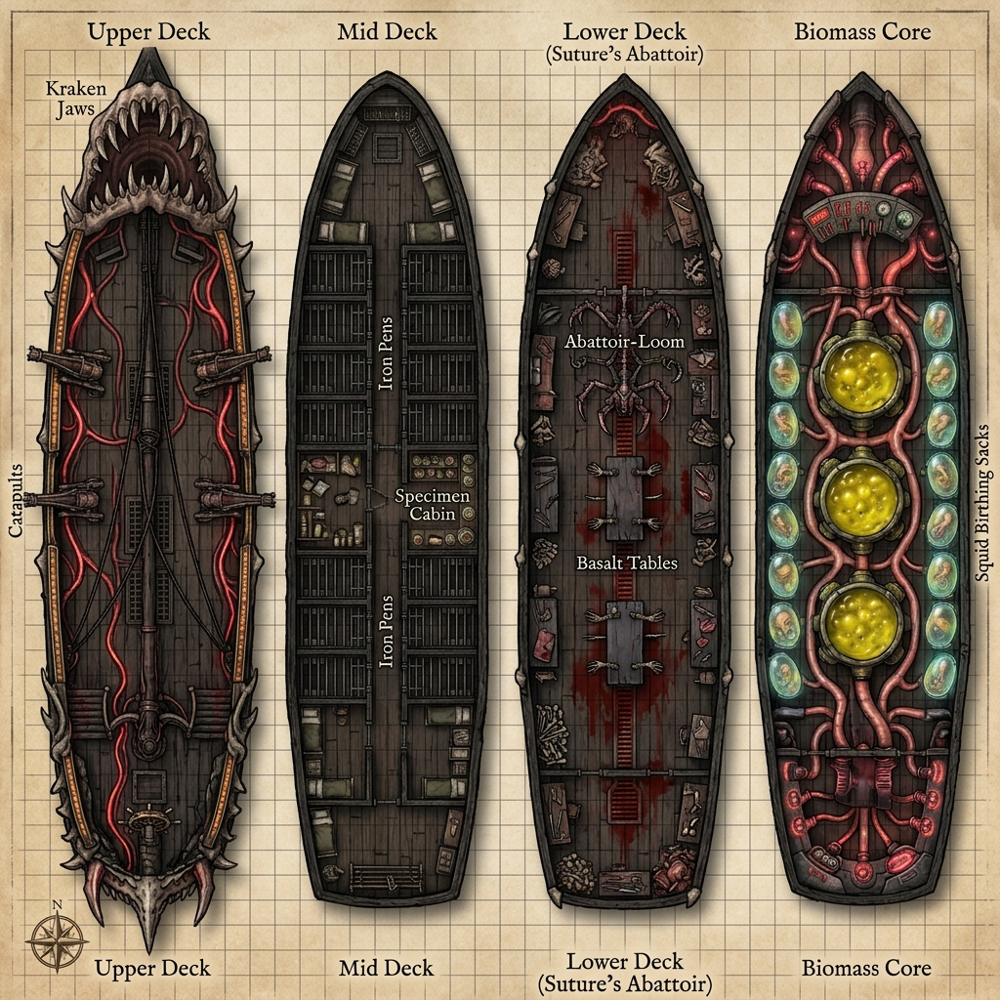
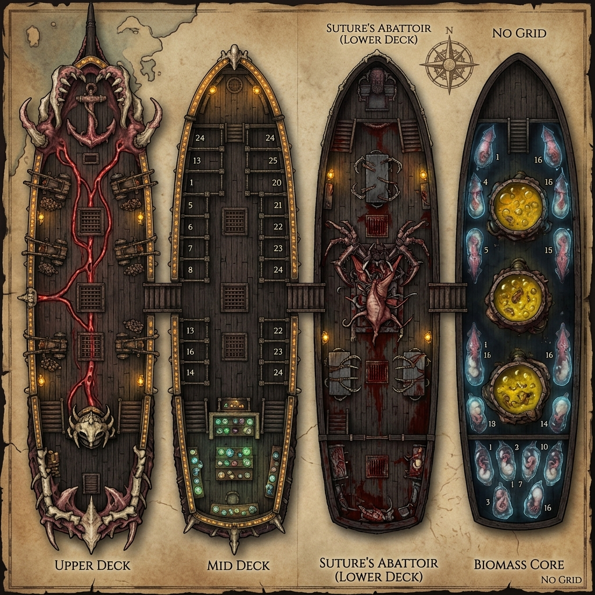
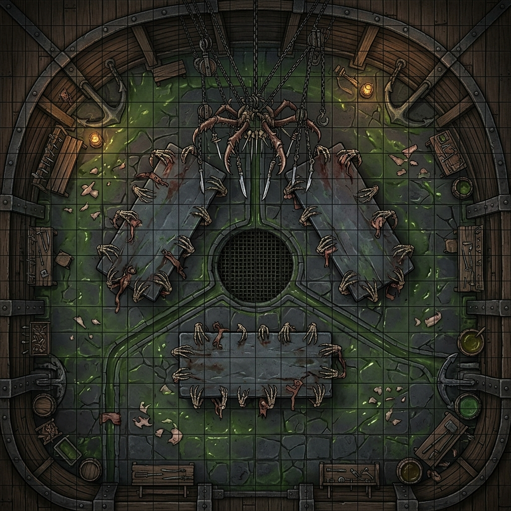
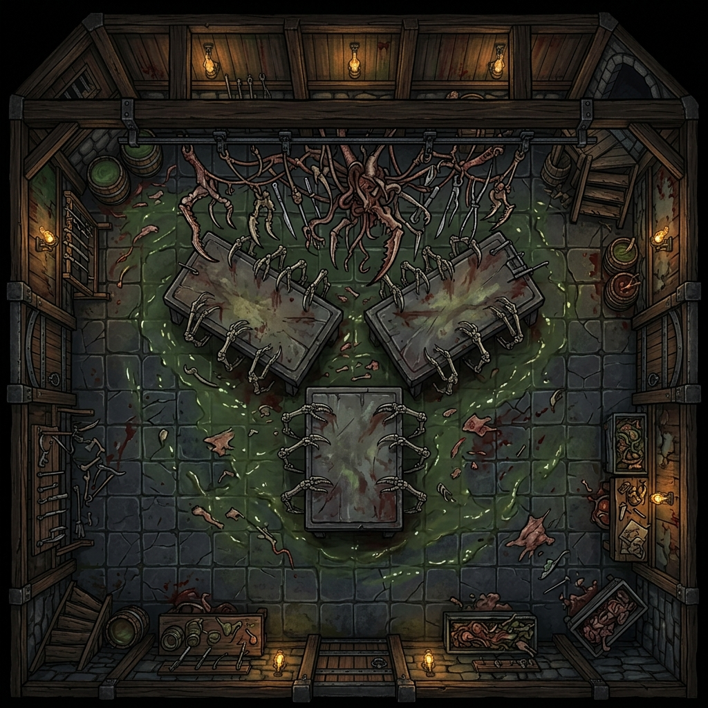
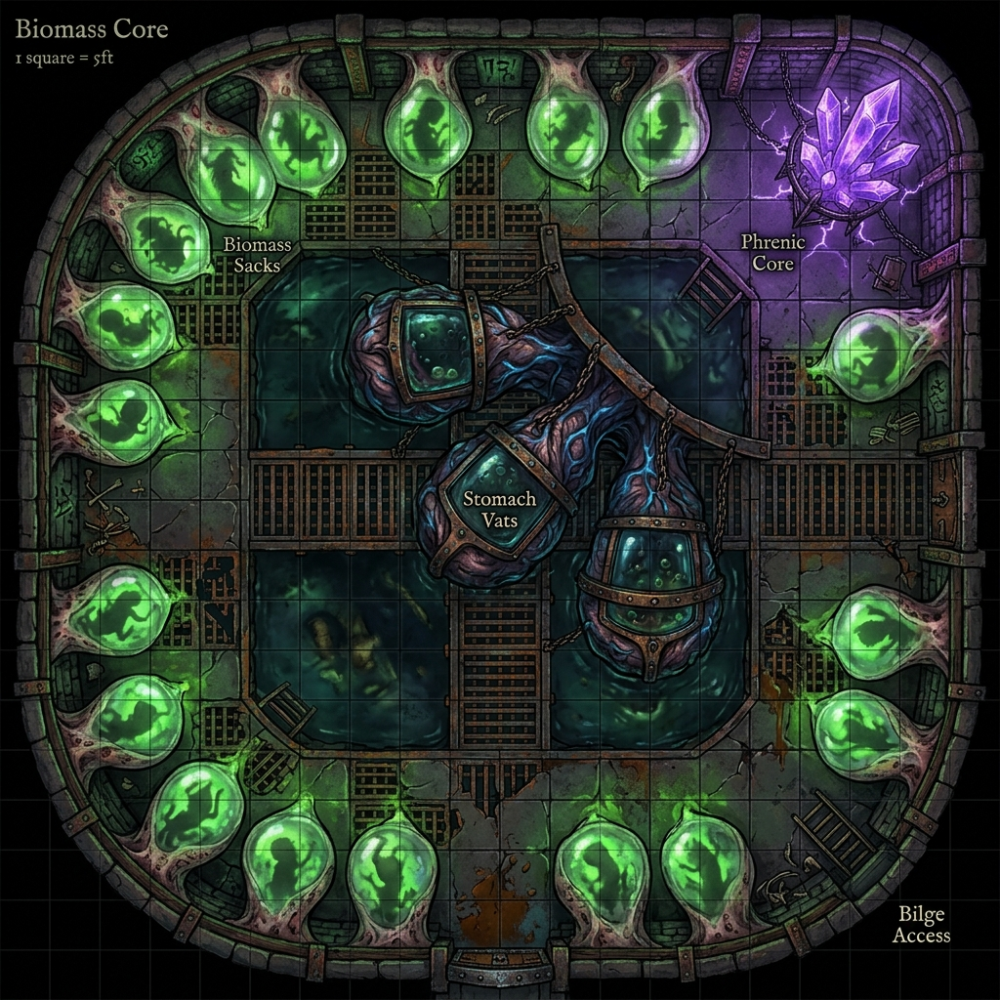
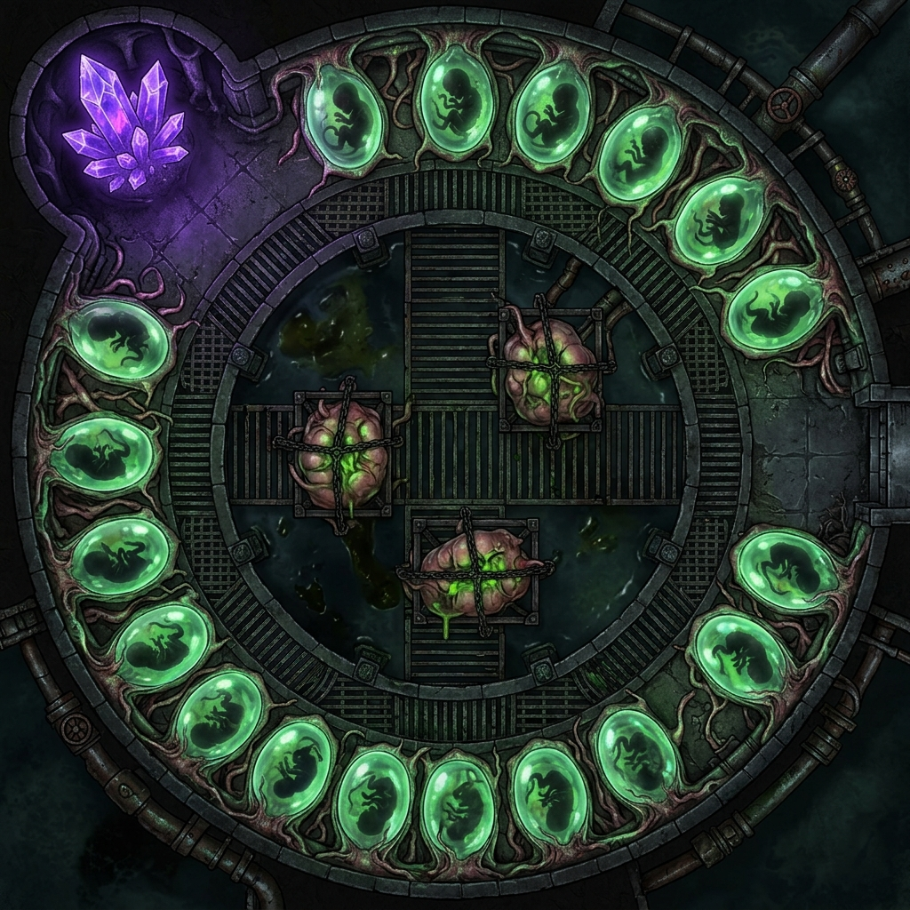

# Suture's Signature Vessel: The Bleeding Needle
## Complete TTRPG Vehicle Manual & Abattoir Operations Guide
### System Compatibility: D&D 3.5 / Pathfinder 1E
### Redesigned Under Suture's Directives (The Anti-Medical Doctrine)

The *Bleeding Needle* is a colossal mobile laboratory dreadnought sheathed in light-devouring *blackwater ironwood* and powered by the **Tri-Weave** (fusing arcane transmutation, psionic resonance, and divine blood-magic). Re-forged under Suture's direct supervision, the vessel is a physical manifestation of Captain Mikhailis (Kael) and Banki’s burning, absolute hatred of the Thessalan Consortium—under whose scalpels the brothers spent decades imprisoned, tortured, and subjected to horrific biomantic experiments. Scorning the sanitized, academic pretense of surface medicine, the dreadnought is a floating **Magic Pirate Abattoir** designed to tear Consortium remnants apart, weaponize their stolen research, and turn their tools of horror back upon them.

---

## 1. VESSEL SPECIFICATIONS & SYSTEMS

```
        +-------------------------------------------------------+
        |                 THE BLEEDING NEEDLE                   |
        +-------------------------------------------------------+
        |  [UPPER DECK] --> Bowsprit Jaw & Boneshard Catapults  |
        |  [MID DECK]   --> Specimen Cabin & Holding Pens       |
        |  [LOWER DECK] --> Basalt Altars & Abattoir-Loom       |
        |  [BIOMASS CORE] -> Siphon Vats & Birthing Caul-Sacks   |
        |  [KEEL CORE]  --> Leviathan Spine & Heart-Cluster     |
        +-------------------------------------------------------+
```

*   **Vessel Class:** Colossal Mobile Abattoir Dreadnought
*   **Dimensions:** 220 ft. long, 60 ft. wide, drawing 24 ft. of water.
*   **Hull Sheathing:** 4-inch *blackwater ironwood* plating (grants DR 15/adamantine and renders the ship invisible to all divination, scrying, and telepathic detection).
*   **Propulsion:**
    1.  **Fleshgrafted Oar-Limbs:** Sixteen massive, webbed claws spliced from kraken-spawn, deep-sea decapod chitin, and aquatic scrags (trolls). They emerge from lower hull ports, rowed by a centralized, shared nervous system and fed by arterial blood-lines from the keel.
    2.  **Biomantic Manta-Dermal Sails:** Translucent living membranes harvested from deep-trench manta-drakes, laced with synthetic muscle-tendons along blackwater ironwood masts. They flex and dilate telepathically to catch thermal vents and planar drafts without making a sound or throwing a wake.

### Tactical Battlemaps

#### Grid Version


#### No-Grid Version


---

## 2. DECK-BY-DECK KEY & THEMED ROOM DESCRIPTION

### DECK I: THE UPPER DECK (THE ATTACK DECK)

#### Room I-A: The Bowsprit Jaw (Suture's Gaping Bow)
The bow of the dreadnought terminates not in a wooden figurehead, but in a horrific, kraken-spliced maw of solid ironwood and calcified bone. 
*   **Themed Description:** The Gaping Bow is a writhing mass of reanimated muscle tendons and thick black ligaments that hold open a pair of multi-tiered jaws. The teeth are carved from the ribs of deep-sea leviathans, each etched with runes of tearing and holding. When Kael rams a target vessel, the jaws snap shut with a sickening crunch, chewing through wood and steel to pin the prey flush against the ship's throat.

#### Room I-B: The Telekinetic Catapult Docks
Four heavy platforms are situated along the deck (two bow, two stern), built of reinforced darkwood and bolted with lead plates.
*   **Themed Description:** Replaces standard ballistas. These catapults launch massive, jagged harpoons carved from calcified leviathan bone wound with silver-threaded cabling. The winding mechanism utilizes **Suture's Myomeric Bio-Winches**—dense bundles of harvested troll muscle tissue bound to brass spindles that contract with sudden, explosive force when triggered telepathically. The firing sequence is non-mechanical and completely silent, marked only by the sudden flash of purple kinetic recoil.

#### Room I-C: The Runic Conduit Rails
Brass piping runs along the deck rails, pulsing with glowing green and crimson fluids pumped from the lower decks.
*   **Themed Description:** The rails are carved with rows of defensive runes designed to purge the decks. As a standard action, the pilot can open the valves, venting a boiling, acidic **Necrotic Blood-Mist** in a 30-ft. cone. The spray smells of vinegar and scorched iron, melting flesh on contact and choking boarding vectors.

#### Room I-D: The Forecastle Lookouts
A raised platform at the extreme bow of the ship, positioned directly above the Bowsprit Jaw.
*   **Themed Description:** The forecastle is a cold, wind-swept perch enclosed by a railing of curved bones. The floor is sheathed in lead plating to block telepathic noise rising from the lower laboratories, allowing the lookouts to focus entirely on scrying the dark waters ahead with their brass spyglasses.

#### Room I-E: The Main Capstan & Windlass
Situated amidships, directly behind the foremast.
*   **Themed Description:** This massive capstan is built of solid fey-metal and ironwood. Instead of hemp rope, it is wound with heavy silver cables that run down through iron-lined hawsepipes to the massive, spiked ironwood anchors. It is operated by a central lever that, when pushed, activates a low-tier psionic winch, allowing a single operator to raise the anchors silently.

#### Room I-F: The Quarterdeck & Ship's Wheel (The Helm)
The raised command deck at the stern of the vessel, overlooking the main deck.
*   **Themed Description:** The helm features a heavy, darkwood wheel mounted on a brass column pulsing with blue light. The column connects directly to the *Leviathan Spine* in the keel, allowing Captain Kael to telepathically feel the water currents and command the ship's rudder. A curved glass canopy protects the helmsman from wind and spray.

#### Room I-G: The Rigging and Masts
The three towering masts (Foremast, Mainmast, and Mizzenmast) rising from the deck.
*   **Themed Description:** The masts are carved from single trunks of abyssal ironwood, reinforced with runic iron bands. The sails are woven from black spider-silk by the Vesh acolytes, laced with silver thread that catches invisible planar winds, allowing the ship to sail silently against the tide.

---

### DECK II: THE MID DECK (THE STASIS HOLD)

#### Room II-A: The Specimen Cabin (The Jars of the Vael-Kaelor)
A long, narrow room lined with heavy ironwood shelves fitted with leather straps to secure their contents during rough seas.
*   **Themed Description:** This room serves as Suture's library of biological components. The shelves are packed with hundreds of glowing clay and raw bone jars containing floating aberration eyes, pulsing hearts, and spliced tissues suspended in green preservative brine. Stolen Dhakaani scroll tubes and Consortium blueprints are pinned to the walls with iron scalpels. The air smells of formaldehyde and dried copper.

#### Room II-B: The Suppressive Holding Pens
A series of 24 heavy iron cages arranged in two rows along the center of the deck.
*   **Themed Description:** The bars of these cages are wound with lead-silver wire mesh and carved with psionic-suppression glyphs. The floor is lined with iron drains to wash away blood. When captives are thrown inside, the glyphs dampen their psionic and magical abilities, leaving them lethargic and unable to cast spells or manifest powers. The cages hum with a low telepathic static that causes minor headaches to anyone nearby.

#### Room II-C: The Stasis lockers
Sixteen horizontal stone caskets lined along the outer hull.
*   **Themed Description:** These caskets are filled with thick, translucent alchemical preservation gel. The lids are heavy slabs of black basalt etched with runes of preservation. When a subject (or wounded PC) is submerged in the gel and the lid is sealed, their biological clock stops. This halts all progression of poison, disease, or Void madness, allowing Suture time to prepare surgeries.

#### Room II-D: The Officer’s Mess & Galley
Located in the aft section of Deck II, opposite the Specimen Cabin.
*   **Themed Description:** A dark-paneled room with a long oak table and six chairs. A hearth of basalt brick contains a self-heating runic grate where deep-trench fish and refined algae are cooked. Suture, Vespera, and Kael dine here, their conversations quiet and clinical.

#### Room II-E: Captain Kael's Quarters (The Sovereign’s Anchor)
The captain’s cabin, located at the absolute stern of Deck II.
*   **Themed Description:** The room is decorated with faded velvet tapestries and shelves of old sea-charts. A heavy desk of blackwood is covered in logbooks and scrying glass pieces. The quarters are warded with lead plating to prevent mental intrusions, providing Kael a quiet sanctuary from the ship's telepathic core.

#### Room II-F: The Crew Quarters (The Vanguard Hammocks)
Located in the fore section of Deck II.
*   **Themed Description:** A large, open space where the 20 Sea-Wolf Hybrids and Suture's Chitin-Bound Rigger Hybrids rest. Hammocks made of coarse spider-silk are suspended from the ceiling beams. The room is damp and smells of sea-salt, mutagens, and wet fur, with small lockers containing personal gear lining the walls.

#### Room II-G: The Armory & Munitions Hold
A warded room adjacent to the Crew Quarters.
*   **Themed Description:** Racks of reiver blades, boneshard spears, and iron-plated shock gear line the walls. Heavy chests contain cartridges of compliance mist and jars of acidic mutagens, secured by runic locks that only Kael or Suture can open.

---

### DECK III: THE LOWER DECK (SUTURE'S SLAUGHTER-FLOOR / THE ABATTOIR)

#### Room III-A: The Basalt Altars (The Three Tables)
The center of the abattoir contains three massive basalt slabs arranged in a triangle directly beneath the mainmast.
*   **Themed Description:** Scorning the sterile tables of the Consortium, these tables are permanently stained with dried blood and coated in a thin layer of nutrient slime to keep harvested tissues alive. Each table is fitted with **Suture-Clamps**—living, skeletal claws that physically rise from the stone to grip subjects. The three tables are named:
    *   *The Altar of the Lattice:* Used for psionic node extractions.
    *   *The Altar of the Thread:* Used for splicing and grafting limbs.
    *   *The Altar of the Maw:* Used for raw slaughter and carcass deconstruction.

#### Room III-B: The Abattoir-Loom Assembly
A terrifying, ceiling-mounted mechanism suspended directly above the Basalt Altars.
*   **Themed Description:** The Loom is a writhing web of spliced chitinous claws, fey-metal needles, and razor-sharp bones. Controlled by Suture’s darkwood limbs via a central phrenic console, the loom moves with manic, terrifying speed, dipping down to cut tissue, inject mutagens, and stitch skin with sub-millimeter precision. The Loom clicks and whirs constantly, sounding like a thousands of skeletal fingers tapping on glass.

#### Room III-C: The Acolyte Bunks
A cramped, shared cabin at the stern of the deck where the 18 House Acolytes sleep.
*   **Themed Description:** The bunks are stacked three-high, built of rough pine boards. The walls are covered in anatomical sketches, alchemical formulas, and faded noble banners of the Remaining Houses (Vae, Carthen, Vrunn, Maelen, Vesh) pinned to the wood. The air smells of mint, sulfur, and dirty laundry, reflecting the acolytes' frantic, exhausted lifestyle.

#### Room III-D: The Water Ballast Tanks
Located along the lower bilge line of Deck III.
*   **Themed Description:** Large ironwood tanks fitted with magic-conduit pumps. They pump seawater and heavy, magically refined mercury to adjust the ship's ballast, allowing the dreadnought to submerge or rise silently without venting air bubbles.

#### Room III-E: The Acidic Bilges
The lowermost drainage area directly beneath Suture's Slaughter-Floor.
*   **Themed Description:** Basalt gutters channel blood, bodily fluids, and wash-water down into these lead-lined bilge pits. The bilges contain a mild alchemical acid to break down organic waste, preventing clogs in the ship's drainage networks.

#### Room III-F: The Centrifuge & Distillation Station
Located adjacent to the basalt tables in Deck III.
*   **Themed Description:** A row of copper boilers and spinning brass centrifuges operated by the Vrunn duergar acolytes. Here, raw bone marrow, spinal fluid, and blood are filtered, separated, and refined into pure mutagenic essences.

#### Tactical Room Maps: Suture's Slaughter-Floor / The Abattoir

##### Grid Version


##### No-Grid Version


---

### DECK IV: THE BIOMASS CORE (THE INCUBATION BAY)

#### Room IV-A: The Siphon Stomach-Vats
Three massive, pulsing biological stomach-vats harvested from colossal sea-monsters, suspended in iron frames.
*   **Themed Description:** These organic vats bubble with a dense mixture of hydrochloric enzymes, troll blood, and alchemical catalysts. Suture’s acolytes dump raw organic waste and carcasses into the vats. The enzymes digest the meat down to raw biomass while keeping the nerves of the tissue firing, ensuring the harvested cells remain active and ready for hybridization.

#### Room IV-B: The Birthing Caul-Sacks
Sixteen floor-to-ceiling organic membranes harvested from giant squids, lining the walls of the core.
*   **Themed Description:** These sacks are translucent, showing the fetal silhouettes of gestating Vanguard constructs (Blink-Hounds, Trench-Fiends) floating in warm amniotic fluids. The membranes pulse rhythmically in sync with the ship's Leviathan Hearts, expanding as the constructs undergo rapid, magically accelerated cellular mitosis.

#### Room IV-C: The Phrenic Crystal Core
A central chamber containing a massive cluster of raw, violet-glowing sapphire matrices.
*   **Themed Description:** The Phrenic Core stores harvested psionic energy. It is linked directly to Kael's telepathic loop, allowing him to monitor the stability of the gestating constructs and feed mental commands to the ship's crew. The air in this room is thick with ozone, and loose items float slightly due to minor gravity distortions.

#### Room IV-D: The Gestation Fluid Reservoirs
A row of massive, flexible bladder-tanks lining the lower bilge of Deck IV.
*   **Themed Description:** These reservoirs are harvested from the swim-bladders of deep-sea trench beasts. They hold thousands of gallons of warm amniotic fluid and nutrient-rich transmutational blood-serum, pumped into the Birthing Caul-Sacks during incubation cycles via pulsing vein-lines.

#### Room IV-E: The Stasis Casket Maintenance Lockers
A narrow storage locker at the aft section of Deck IV.
*   **Themed Description:** Racks of spare runic basalt plates, copper wiring coils, and jars of thick lavender stasis gel. The Vae acolytes use this room to store tools needed to calibrate the chronal summoners and repair stone caskets.

#### Tactical Room Maps: The Biomass Core & Incubation Bays

##### Grid Version


##### No-Grid Version


---

### THE KEEL: THE LEVIATHAN SPINE & HEART-CHAMBER

#### The Leviathan Spine
The central keel of the ship, visible as a massive spinal column running along the floor of the lower decks.
*   **Themed Description:** The keel is constructed from the fossilized vertebrae of an ancient deep-sea leviathan. The bone has been reanimated with pulsing necrotic veins, allowing the ship to feel water currents and telepathically report structural status to the bridge.

#### The Heart-Cluster (The Heart-Chamber)
A dark, humid room situated at the absolute center of the keel.
*   **Themed Description:** Replaces standard engines. Suspended in a cage of blackwater ironwood is a massive, pulsing cardiovascular cluster of **three fused Leviathan Hearts**. Suture feeds this cluster with distilled blood-serum and mutagens. The heart beats rhythmically, pumping thick necrotic blood through a highway of arteries lining the ship's frames to feed the oar-limbs and stabilize the vessel.

---

## 3. THEMED CREW ROSTER & SPECIFIC PROFILES

### A. The Command Triad
1.  **Suture (Commander — Void-Touched Fleshwarper):** 
    *   **Visual:** Suture is a thin, skeletal human who wears a tight lead-plated blindfold to block out physical light, relying entirely on his mindsight. Grafted to his torso are four mechanical/biomantic darkwood limbs tipped with silver scalpels and needles. His skin is stained yellow by acid, and he wears an apron of boiled sharkskin.
    *   **Role:** Kael's crazed apprentice who scorns the regulated titles of surface medicine. He coordinates all laboratory work, surgical enhancements, and shipboard integrations.
2.  **Stitch (Lab Warden — Flesh Golem Prototype):**
    *   **Visual:** A towering, 9-foot-tall construct stitched from the muscles of aquatic scrags and duergar mercenaries. His skin is a patchwork of blue-green scales and pale flesh, bolted with iron brackets.
    *   **Role:** Guard of the Biomass Core. Stitch stands motionless at the entrance of Deck IV, enforcing absolute compliance. He is immune to magic and slams intruders with his massive fists.
3.  **Vespera Thran (Chief Apothecary):**
    *   **Visual:** A human cleric of the Veil, thin to the point of being skeletal, smelling of grave-earth and lye. She wears black wool robes and carries a silver censer.
    *   **Role:** Suture's primary assistant, managing mutagen synthesis and specimen stabilization. She is emotionally detached and prioritizes the laboratory's output over individual survival.

### B. The Lab Staff
*   **18x House Acolytes (Suture's Surgical Assistants):** Rather than lobotomized thralls, these are the youth of the Remaining Houses of Blackwater Quay, drafted into the abattoir under the **Flesh Debt** clause of the *Shadow-Vassal Decree* signed by the nobility. 

    Because the noble houses of the Quay turned a blind eye to—or directly profited from—the Thessalan Consortium’s decade-spanning kidnapping and experimentation ring that imprisoned Kael and Banki, the brothers view these children as **living reparations**. Ostensibly held as collateral hostages to guarantee their families' compliance, they have been apprenticed to Suture to learn the raw, anti-ethical biomancy born of their families' complicity. Over time, as Kael's fleet makes their houses incredibly wealthy through laundered plunder, these youths are outgrowing their hostage status, aligning fully with the crew's crusade to watch the Consortium's survivors shatter. 
    
    *(See full dossiers in the Acolyte Roster file for names and character sheets).*
*   **30x Chitin-Bound Rigger Hybrids (Biomantic Riggers):** Low-sentience amphibious humanoids spliced with decapod chitin plates and webbed digits, grown in Deck IV birthing sacks. Guided by the 18 House Acolytes and Kael's telepathic loop, they manage sail tension, haul bio-cables, and maintain the oar-limb arterial pumps.

### C. The Deck Force & Sentinels
*   **20x Sea-Wolf Hybrids (CR 5):** Spliced aquatic sentinels who patrol the upper decks and locks. They climb the rigging, steer the ship under Kael's command, and serve as boarding guards. (Tripping bites, Swim speed 40 ft., aqueous camouflage).

### D. The Vanguard Security (Stasis Holds)
Stored in the Deck II stasis caskets and Deck IV birthing sacks, these biological shock-troopers are ready to be deployed via the deck slide-tubes during combat:
*   **4x Blink-Hound Shock-Troopers (CR 6):** Spliced combat beasts with displacer hide grafts, capable of shifting out of phase to intercept boarders.
*   **4x Trench-Fiend Guardians (CR 7):** Massive, regeneration-grafted aquatic scrags armed with rusted iron harpoons, deployed directly into the water to defend the hull from undersea attacks.

---

## 4. TTRPG STATISTICS (D&D 3.5 / PATHFINDER 1E)

### The Bleeding Needle (Master Profile)
*   **Vessel Class:** Colossal Mobile Abattoir Dreadnought
*   **Dimensions:** Space 220 ft. by 60 ft.; Height 40 ft. (plus masts); Draw 24 ft.
*   **Seaworthiness:** +12; **Ship Handling:** +6 (requires a minimum crew of 10)
*   **Speed:** Swim 40 ft. (flesh-rowed by claws, spirit-driven by sails); turns in place (0 ft. turning radius when rowing).
*   **Overall Armor Class (AC):** 22 (-8 size, +20 natural/ironwood plating).
*   **Hardness:** 15 (blackwater ironwood sheathing).
*   **Hit Points (HP):** 900 (Break threshold 300; at <300 HP, seaworthiness checks are made at a -8 penalty).
*   **Immunities:** The hull is immune to acid, cold, and mind-affecting effects, and cannot be detected by divination or telepathic scrying.
*   **Ram:** 12d6 bludgeoning/piercing damage (ignores up to 10 points of target hardness due to the Gaping Bow figurehead jaws).

---

### Propulsion System I: The Fleshgrafted Oar-Limbs (Rigged Oarmen)
This system consists of sixteen massive, webbed claws spliced from kraken-spawn, decapod chitin, and deep-sea scrags (aquatic trolls). They emerge from lower hull ports, rowed by a centralized, shared nervous system and fed by arterial blood-lines from the keel.

#### Individual Oar-Limb Statistics (16 Limbs Total)
*   **Size/Reach:** Space 10 ft. by 10 ft.; extends up to 20 ft. from the vessel's hull.
*   **Armor Class (AC):** 18 (-1 size, +9 natural).
*   **Hit Points (HP):** 60 per limb; **Hardness:** 5; **DR:** 5/piercing or slashing.
*   **Resistances:** Fire 10, Electricity 10. **Immunities:** Cold, mind-affecting.
*   **Regeneration 5 (Acid/Fire):** Spliced with aquatic troll (scrag) DNA, each oar-limb regenerates 5 hit points at the start of its turn. If a limb takes acid or fire damage, its regeneration does not function on its next turn. A limb reduced to 0 HP is severed/destroyed and cannot regenerate until Suture performs a surgical graft in dry-dock.
*   **Tactical Thresholds:**
    *   *13–16 Limbs Active:* Swim speed 40 ft.
    *   *9–12 Limbs Active:* Swim speed 30 ft.
    *   *5–8 Limbs Active:* Swim speed 15 ft.
    *   *1–4 Limbs Active:* Swim speed 5 ft.; cannot turn in place.
    *   *0 Limbs Active:* Oar-propulsion is disabled.

#### Shared Synapse Node (The System Brain)
*   **Location:** Deck IV (Room IV-A: Incubation Bay console).
*   **Statistics:** HP 100; Hardness 0; **DR:** 5/cold iron. **Saves:** Will +8.
*   **Vulnerability:** Mind Blast, Mindsight manipulation, or psychic damage targeting the node *stuns* the entire oar-limb network for 1d4 rounds, during which the ship cannot row or use oar attacks. If the Synapse Node is reduced to 0 HP, the oar-limbs go completely limp and oar-propulsion is disabled until a new node is grown and calibrated (requires 1 week and 500 gp in biomass materials).

#### Oar-Limb Combat & Biomantic Actions (Controlled by Helmsman/Pilot)
*   **Claw Swipe (Standard Action):** The ship makes up to 4 claw attacks per round (split between port and starboard). Attack: +10 melee; Damage: 2d6+6 slashing plus Grab.
*   **Crushing Grab (Free Action on Hit):** If a claw swipe hits a creature or vessel of Large size or smaller, the limb makes a free grapple check (+16). On a success, the target is pinned against the hull.
*   **Abattoir Constrict & Siphon (Passive):** At the start of the ship's turn, any pinned creature or vessel takes 2d6+6 crushing damage. If the pinned target is an organic creature, 1d6 points of this damage is siphoned as biomass, healing 5 HP to the grappling oar-limb.
*   **Suture's Mutagenic Adrenaline Surge (Swift Action, 3/day):** Suture or the pilot triggers the arterial sump pumps, flooding the oar-limbs with pure scrag adrenaline. The ship's swim speed increases by +20 ft. (to 60 ft.), and all claw attacks gain a +2 bonus on attack and damage rolls for 3 rounds.

---

### Propulsion System II: Biomantic Manta-Dermal Sails & Tendon Rigging
Translucent, living skin-membranes harvested from deep-sea manta-drakes are spliced into blackwater ironwood masts and bound to myomeric muscle-tendons.

*   **Rigging & Skin-Sails HP:** 160 (Masts and dermal sails combined; Break threshold 40).
*   **Armor Class (AC):** 16 (-8 size, +14 natural/myomeric flexibility).
*   **Hardness:** 5 (living hide density); **DR:** 5/slashing.
*   **Immunities:** Immune to cold, acid, electricity, and mind-affecting effects.
*   **Vulnerability:** Fire. The living skin-sails take double damage from fire-based spells and environmental fire.
*   **Hydro-Acoustic Camouflage:** When moving solely by dermal sails, the skin-cells dilate to absorb water vibrations and sound. The ship throws no wake and grants a +10 bonus on Stealth checks to navigate dark waters completely undetected.

---

### Mage-Tech Weaponry & Hazards

#### Barbed Boneshard Harpoon (Bow & Stern)
*   **Attacks:** +8 ranged (within 100 ft.).
*   **Damage:** 3d8 ballista damage plus automatic grapple check.
*   **Grapple Effect:** On a successful grapple, the target vessel's speed is halved. The bone spindles can drag the target 20 ft. closer at the start of each of the *Needle's* turns.

#### Alchemical Blood Vent (Hazard)
*   **Action:** Standard action (activated from the bridge).
*   **Effect:** A 30-ft. cone of boiling, acidic blood and compliance mist erupts from the runic conduits. All creatures in the area take 4d6 fire/acid damage and must succeed on a DC 16 Fortitude save or be *sickened* for 1d4 rounds by the chemical vapors.

---

## 5. EXPEDITION LAUNCHPAD OPERATIONS (PC SERVICES)

When the player characters utilize the *Bleeding Needle* as their expedition launchpad and mobile sanctuary, they gain access to the following specialized services, systems, and rest protections:

### A. The Runic Shroud (Safe Haven Rest Rules)
*   **Intrusion Immunity:** The dreadnought's sheathing of *blackwater ironwood* and lead-silver warded chambers completely shield the interior from the Elder Node's telepathic reach. While resting aboard the *Bleeding Needle*, PCs are completely immune to the daily sanity checks, mental fatigue, or psychic sweeps of the Campaign's daily intrusion tables.
*   **Stasis Recovery:** A PC placed in one of Suture's stasis caskets enters a suspended animation state. This halts all progression of poison, disease, The Void of Madness madness, or biological corruption, allowing the crew time to prepare remedies or grafts.

### B. Suture's Biomantic Grafting Clinic
*   **Harvesting Materials:** PCs can harvest raw materials (tissue samples, glands, claws) from defeated Underdark monsters and bring them to Suture's abattoir.
*   **Graft Application:** Suture will perform any of the biomantic grafts listed in the player options. Due to Suture's mastery and the assistance of the 18 House Acolytes, all Heal checks made during these operations receive a **+5 masterwork bonus**, and the required surgical recovery times are reduced by 50%.

### C. Alchemical Essence Refining (Resource Conversion)
The PCs can turn over captured enemies or monster carcasses to Suture and his acolytes, who process them into refined magical assets:
*   **Arcane Ink:** Siphoned from arcane spellcasters. (Can be used to write scrolls or add spells to a wizard's spellbook at 75% of the standard gold cost).
*   **Psionic Node Crystals:** Extracted from psionicists. (Can be dissolved to restore 1d4+1 power points or recharge psionic items).
*   **Divine Gold Serum:** Refined from divine spellcasters. (Can be consumed as a standard action to restore a single expended divine spell slot of up to 4th level).

### D. Benthic Navigation & Bridge Controls
*   **Telepathic Bridge:** The helm is connected to the reanimated Leviathan Spine. A pilot telepathically linked to the ship gains a **+4 bonus on Knowledge (dungeoneering) and Psicraft checks** to navigate deep-sea trenches, detect volcanic thermal vents, or avoid gravity anomalies.
*   **Acolyte Crew Support:** The 18 House Acolytes handle all routine ship management and weapon operations during encounters. The PCs do not need to spend actions firing the Boneshard Harpoons or steering, allowing them to focus entirely on combat, spellcasting, or boarding strategies.
